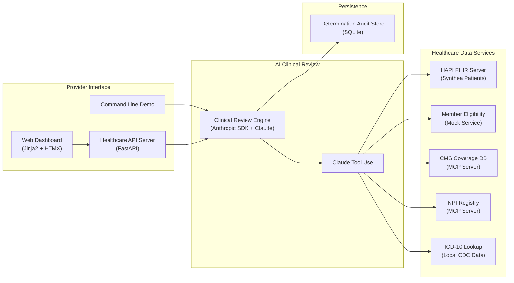
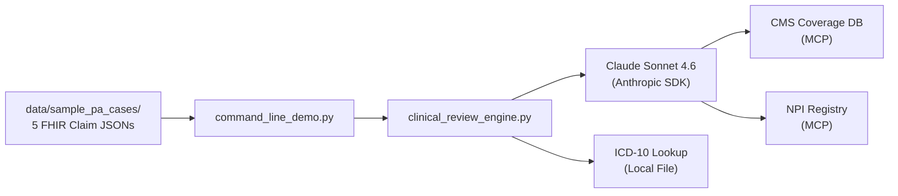
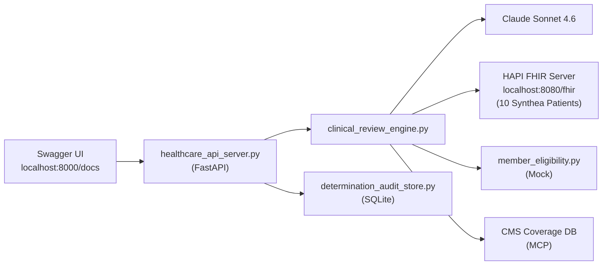
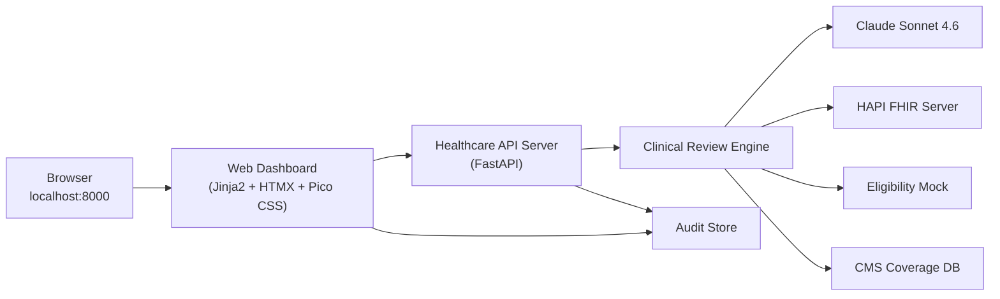
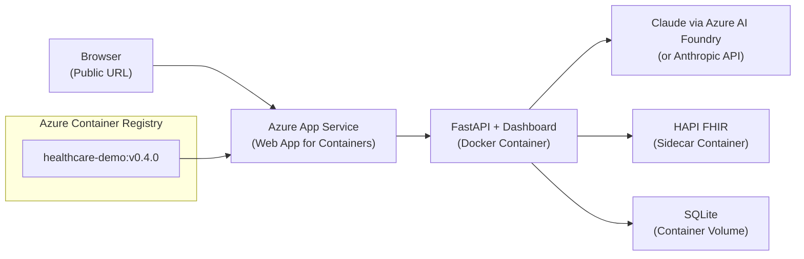
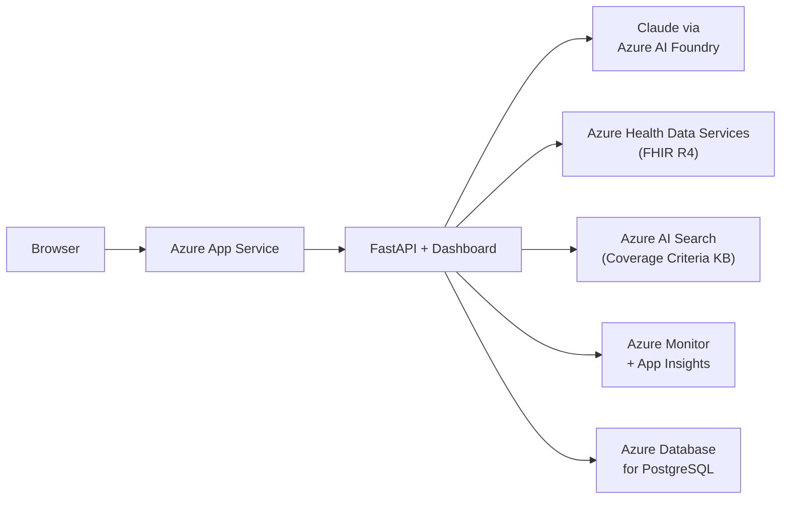

# Demo Implementation Specification
## AI-Driven Prior Authorization — Autonomize Healthcare AI Demo
### March 24, 2026

> **For Claude Code**: This document is a phased implementation specification. Execute one phase at a time. Each phase ends with a verification gate — run the verification commands, confirm they pass, then commit, tag, and create a release branch before starting the next phase. Do not proceed past a failed gate.

---

# Part 1: Strategic Context

## 1.1 Mission and Success Criteria

**Who**: Paul Prae, Principal AI Engineer & Architect candidate at Autonomize AI
**What**: Build a working proof-of-concept of AI-driven prior authorization review
**When**: March 24, 2026. Presentation is this afternoon.
**Where**: Repository at `C:\dev\autonomize-healthcare-ai-demo`
**Why**: Prove that the enterprise solution architecture (presented in slides) is implementable. Demonstrate AI engineering skill and architectural judgment. Show how Autonomize could leverage Claude for PA automation.

**The demo succeeds when:**
1. All 5 PA test cases produce clinically appropriate determinations with evidence-backed reasoning
2. The system is demo-able at any phase checkpoint (CLI, API, web dashboard, or cloud URL)
3. A non-technical executive can watch the demo and understand what the AI is doing and why
4. A solutions architect (ex-Elevance Health) recognizes the integration patterns as realistic
5. A VP of engineering (ex-Google Cloud) sees clean architecture and proper engineering practices

## 1.2 Assignment Alignment

This demo is Phase 0 of the implementation roadmap presented in the slide deck. It answers the interview assignment by proving the architecture is not theoretical:

| Assignment Section | What the Demo Proves |
|---|---|
| Part 1.1: High-Level Architecture | The four-actor system context (Provider → AI Platform → Health Plan → Regulator) works end-to-end |
| Part 1.2: Integration Design — Ingestion | PA requests are received as structured FHIR Claims via API |
| Part 1.2: Integration Design — Clinical Data | Clinical data is retrieved from a FHIR R4 server (HAPI FHIR) |
| Part 1.3: Security & Compliance | Audit trail captures every determination with full reasoning chain |
| Part 2.1: Executive Summary | Working demo validates the business case: AI reviews PA requests in seconds, not days |
| Part 2.2: Implementation Phases | This demo IS Phase 0 — progressive delivery from CLI to cloud |
| Part 3.1: AI/ML Strategy | Confidence-based routing demonstrates the human-in-the-loop pattern |
| Part 3.2: Future State Scaling | Phase 5 shows migration path to Azure managed services |

**Full assignment**: `docs/inputs/assignment.md`
**Full solution architecture**: `docs/architecture/solution-architecture.md`
**Presentation**: `docs/architecture/presentation.md`
**Research backing**: `docs/architecture/research-context.md`

## 1.3 Stakeholder Trust Targets

| Stakeholder | Role | What They Need to See |
|---|---|---|
| **Kris Nair** | Co-Founder & COO, Autonomize AI | Working AI that automates real healthcare workflows. Business outcome: speed, accuracy, compliance. |
| **Suresh Gopalakrishnan** | Solutions Architect (ex-Elevance Health, 4+ years) | Realistic integration patterns — FHIR R4 clinical data, payer eligibility checks, coverage criteria matching. Real ICD-10/CPT codes. Clinically appropriate determinations. |
| **Ujjwal Rajbhandari** | VP Solutions & Delivery Engineering (ex-Google Cloud, ex-Dell) | Clean API design, proper error handling, cloud-native architecture, engineering discipline. FHIR R4 compliance. Scalability patterns. |

**Stakeholder profiles**: `docs/inputs/stakeholder-profiles.md`
**Job description**: `docs/inputs/job-description.md`

## 1.4 Presentation Narrative Tie-In

The demo supports the slide deck narrative at these points:

| Slide | Demo Moment |
|---|---|
| Slide 2 (Executive Summary) | "To validate these numbers, I built a working proof-of-concept..." |
| Slide 3 (System Context) | "Here's the four-actor pattern running live — provider submits, AI reviews, determination routes..." |
| Slide 5 (PA Processing Flow) | Walk through Case 1 showing each of the 6 lifecycle steps |
| Slide 6 (Security) | Show the audit trail with full reasoning chain and evidence citations |
| Slide 8 (LLMOps) | "The confidence scoring you see here is how we'd detect drift in production..." |
| Slide 9 (Roadmap) | "This demo is Phase 0. Phase 1 would connect to Autonomize's PA Copilot..." |

**Slide prompts**: `docs/architecture/slide-generation-prompts.md`

## 1.5 Scope Boundary

**What this demo does:**
- Receives PA requests as FHIR R4 Claims via CLI and REST API
- Retrieves clinical data from a real FHIR R4 server (HAPI FHIR with Synthea patients)
- Uses Claude (Anthropic SDK) with tool use for clinical review
- Routes determinations by confidence: auto-approve, human review, pend for info
- Logs every determination with audit trail
- Presents results in a web dashboard

**What this demo does NOT do (and the enterprise architecture covers):**
- Fax ingestion / OCR (enterprise Phase 2)
- X12 278 EDI processing (enterprise Phase 2)
- Legacy database connectors (enterprise Phase 2)
- Multi-LOB configuration (enterprise Phase 3)
- Production security hardening (enterprise Phase 1)
- Auto-denial without human review (enterprise policy decision)
- Connect to Autonomize PA Copilot or Genesis Platform (enterprise Phase 1)

---

# Part 2: Architecture and Technical Decisions

## 2.1 Final-State Demo Architecture (Phase 3 Complete)



## 2.2 Tech Stack with Research Backing

| Layer | Technology | Version | Why This Choice | Source |
|---|---|---|---|---|
| **Language** | Python | 3.12+ | Autonomize uses Python. Anthropic SDK is Python-first. | [Anthropic SDK](https://github.com/anthropics/anthropic-sdk-python) |
| **AI Provider** | Anthropic SDK (direct) | Latest | Preferred for Claude-first apps over LangChain. MCP-native, tool use, long context. | [research-context.md § SDK Direction](../../docs/architecture/research-context.md) |
| **LLM** | Claude Sonnet 4.6 | claude-sonnet-4-6-20260320 | Best cost/performance for structured clinical reasoning. Upgrade to Opus if needed. | [Anthropic Pricing](https://www.anthropic.com/pricing) |
| **FHIR Models** | `fhir.resources` | 8.2.0 | Pydantic v2 native. Covers all FHIR R4B resources. BSD license. | [PyPI](https://pypi.org/project/fhir.resources/) |
| **API Framework** | FastAPI | Latest | Async, Pydantic-native, auto-generates OpenAPI/Swagger. Industry standard. | [FastAPI docs](https://fastapi.tiangolo.com/) |
| **ASGI Server** | Uvicorn | Latest | Official FastAPI recommendation. No Gunicorn wrapper needed. | [FastAPI deployment](https://fastapi.tiangolo.com/deployment/) |
| **FHIR Server** | HAPI FHIR (Docker) | Latest | One-command setup. Production-grade, FHIR R4 compliant, open source. | [HAPI FHIR](https://hapifhir.io/) |
| **Clinical Data** | Synthea FHIR R4 | 10-patient bulk | Apache 2.0. Realistic synthetic patients with conditions, observations, encounters. | [SMART on FHIR samples](https://github.com/smart-on-fhir/sample-bulk-fhir-datasets) |
| **PA Data Model** | Da Vinci PAS IG | STU 2.0.1 | FHIR Claim with `use: preauthorization`. The authoritative PA data standard. | [HL7 Da Vinci PAS](https://hl7.org/fhir/us/davinci-pas/) |
| **Test Fixtures** | `polyfactory` | Latest | Generates test data from Pydantic models. MIT license. | [PyPI](https://pypi.org/project/polyfactory/) |
| **Web UI** | Jinja2 + HTMX + Pico CSS | Latest (CDN) | No npm, no build step, no JS framework. Single container. 65% ML startup adoption. | [HTMX](https://htmx.org/), [Pico CSS](https://picocss.com/) |
| **Audit Store** | SQLite | Built-in | Zero config, file-based, sufficient for demo. Production would use PostgreSQL. | Python stdlib |
| **Containerization** | Docker (single-stage) | python:3.12-slim | Official FastAPI recommendation. Simple, small image. | [FastAPI Docker](https://fastapi.tiangolo.com/deployment/docker/) |
| **Cloud Hosting** | Azure App Service | Web App for Containers | Autonomize is Azure-native (Pegasus Program, Azure Marketplace). | [research-context.md § Cloud Platform](../../docs/architecture/research-context.md) |
| **CI/CD** | GitHub Actions | Latest | Microsoft-provided actions for ACR + App Service. 15-line workflow. | [Azure deploy action](https://learn.microsoft.com/en-us/azure/app-service/deploy-container-github-action) |

**Excluded by design:**
- No LangChain (unnecessary abstraction for single-provider use case — [research-context.md § SDK Direction](../../docs/architecture/research-context.md))
- No Kafka or message queue (over-engineering for a demo — KISS principle)
- No PostgreSQL (SQLite is sufficient for demo; PostgreSQL is the production choice per [solution-architecture.md § Technology Decision Table](../../docs/architecture/solution-architecture.md))
- No Streamlit (requires separate process/port, fights with FastAPI)
- No React/Next.js (requires npm build pipeline, too complex for 1-day build)

## 2.3 Project Structure and Naming Conventions

Names are chosen for onboarding clarity. A new engineer should understand each file's role without reading it.

```
autonomize-healthcare-ai-demo/
├── src/
│   └── prior_auth_demo/                      # Python package
│       ├── __init__.py
│       ├── clinical_review_engine.py         # Core AI: Claude + tool use → determination
│       ├── command_line_demo.py              # CLI entry point (argparse)
│       ├── healthcare_api_server.py          # FastAPI REST API
│       ├── application_settings.py           # Pydantic Settings (env vars)
│       ├── determination_audit_store.py      # SQLite audit trail
│       ├── mock_healthcare_services/
│       │   ├── __init__.py
│       │   └── member_eligibility.py         # Mock: FHIR CoverageEligibilityResponse
│       └── web_dashboard/
│           ├── dashboard_routes.py           # FastAPI Jinja2 template routes
│           └── templates/
│               └── review_dashboard.html     # HTMX + Pico CSS
├── data/
│   ├── sample_pa_cases/                      # 5 FHIR Claim bundles (curated)
│   │   ├── 01_lumbar_mri_clear_approval.json
│   │   ├── 02_cosmetic_rhinoplasty_denial.json
│   │   ├── 03_spinal_fusion_complex_review.json
│   │   ├── 04_humira_missing_documentation.json
│   │   └── 05_keytruda_urgent_oncology.json
│   ├── synthea_fhir_patients/                # 10 Synthea FHIR R4 patients (downloaded)
│   │   └── README.md                         # Download instructions + license
│   └── reference/
│       └── icd10cm_codes_2026.tsv            # CDC ICD-10-CM subset for validation
├── tests/
│   ├── test_clinical_review_engine.py
│   ├── test_healthcare_api_server.py
│   ├── test_determination_audit_store.py
│   └── conftest.py                           # Shared fixtures (polyfactory + FHIR models)
├── docs/
│   └── demo_vs_production_architecture.md    # Maps demo components to enterprise architecture
├── pyproject.toml
├── Makefile                                  # make install, make dev, make test, make docker
├── Dockerfile                                # Phase 4: single-stage python:3.12-slim
├── docker-compose.yml                        # Phase 2+: app + HAPI FHIR
├── .github/workflows/deploy-azure.yml        # Phase 4: GitHub Actions → ACR → App Service
├── .env.example
├── CLAUDE.md
└── README.md
```

## 2.4 PA Data Model (FHIR-Based)

Use `fhir.resources.R4B` Pydantic models directly. Do not invent custom models for PA domain objects.

**PA Request** = FHIR `Claim` with `use: "preauthorization"` (per Da Vinci PAS IG)
**PA Response** = FHIR `ClaimResponse` with determination, reasoning, evidence

Key FHIR resources used:
```python
from fhir.resources.R4B.claim import Claim                    # PA request
from fhir.resources.R4B.claimresponse import ClaimResponse    # PA determination
from fhir.resources.R4B.patient import Patient                # Member demographics
from fhir.resources.R4B.coverage import Coverage              # Insurance coverage
from fhir.resources.R4B.condition import Condition            # Diagnoses
from fhir.resources.R4B.procedure import Procedure            # Procedures
from fhir.resources.R4B.practitioner import Practitioner      # Requesting provider
from fhir.resources.R4B.bundle import Bundle                  # FHIR transaction bundles
```

**Application-specific models** (thin wrappers for API/UI, not replacing FHIR):
```python
# In clinical_review_engine.py
class ClinicalReviewResult(BaseModel):
    """Output of the AI clinical review — wraps FHIR ClaimResponse with demo-specific fields."""
    determination: Literal["APPROVED", "DENIED", "PENDED_FOR_REVIEW", "PENDED_MISSING_INFO"]
    confidence_score: float  # 0.0 to 1.0
    clinical_rationale: str  # AI-generated reasoning narrative
    guideline_citations: list[str]  # Evidence sources cited
    missing_documentation: list[str] | None  # If pended for missing info
    fhir_claim_response: ClaimResponse  # Full FHIR-compliant response
    review_duration_seconds: float
```

## 2.5 Healthcare Service Contracts

### Real Services (Not Mocked)

**HAPI FHIR Server** — clinical data retrieval:
```
GET http://localhost:8080/fhir/Patient?identifier={member_id}
GET http://localhost:8080/fhir/Condition?patient={patient_id}
GET http://localhost:8080/fhir/Observation?patient={patient_id}
GET http://localhost:8080/fhir/Procedure?patient={patient_id}
```

**CMS Coverage Database** — coverage criteria lookup (via MCP from anthropics/healthcare):
- Provides LCD/NCD lookups for coverage determinations
- MCP endpoint: `https://mcp.deepsense.ai/cms_coverage/mcp`

**NPI Registry** — provider validation (via MCP from anthropics/healthcare):
- Validates provider NPI, returns specialty and practice info
- MCP endpoint: `https://mcp.deepsense.ai/npi_registry/mcp`

**ICD-10 Validation** — local lookup from CDC data:
- Validate diagnosis codes against FY 2026 ICD-10-CM file
- Source: `https://ftp.cdc.gov/pub/health_statistics/nchs/publications/ICD10CM/2026/`

### Mock Service (One Only)

**Member Eligibility** — no open-source payer eligibility API exists:
```
POST /mock/eligibility/check
  Input: member_id, service_date, procedure_code
  Output: FHIR CoverageEligibilityResponse (eligible: true/false, plan_type, copay)
```
This is a thin FastAPI router (~30 lines) that returns a realistic FHIR response. In production, this connects to the Payer Core System (TriZetto Facets, QNXT, etc.) per the enterprise architecture.

## 2.6 Testing Strategy and Quality Assurance

### Testing Pyramid

Every phase follows this test sequence. **All automated tests must pass before Paul does any human review.** Claude Code runs the automated suite; Paul runs the human UAT.

```
┌─────────────────────────────────────┐
│  5. HUMAN UAT (Paul)                │  ← Paul walks through checklist
│     Manual demo walkthrough         │     ~10 min per phase
├─────────────────────────────────────┤
│  4. AI ARCHITECTURE REVIEW          │  ← Claude Code self-review
│     Code quality, security, FHIR    │     Runs as subagent
├─────────────────────────────────────┤
│  3. END-TO-END TESTS                │  ← Full flow with real AI
│     Submit case → get determination  │     Requires ANTHROPIC_API_KEY
├─────────────────────────────────────┤
│  2. INTEGRATION TESTS               │  ← Service connectivity
│     FHIR server, audit store, API    │     Requires Docker (Phase 2+)
├─────────────────────────────────────┤
│  1. UNIT TESTS                      │  ← Pure logic, no network
│     Models, thresholds, lookups      │     Fast, no API key needed
└─────────────────────────────────────┘
```

### Automated Test Infrastructure

**Test markers** (in `conftest.py`):
```python
import pytest

# Markers for selective test execution
# Usage: pytest -m unit (fast, no API key)
# Usage: pytest -m integration (needs Docker services)
# Usage: pytest -m e2e (needs ANTHROPIC_API_KEY, slow)
```

**Makefile targets**:
```makefile
test-unit:          # Fast, no external deps — runs in <5 seconds
	pytest tests/ -m unit -v
test-integration:   # Needs Docker services running
	pytest tests/ -m integration -v
test-e2e:           # Needs ANTHROPIC_API_KEY, runs all 5 cases
	pytest tests/ -m e2e -v --timeout=300
test-all:           # Full suite
	pytest tests/ -v --timeout=300
test-data-quality:  # Validate FHIR data files
	pytest tests/test_data_quality.py -v
lint:
	ruff check src/ tests/
	ruff format --check src/ tests/
```

### Data Quality Tests (`tests/test_data_quality.py`)

Run on every phase. Validate that all sample PA cases and reference data are well-formed:

- Each file in `data/sample_pa_cases/` parses as a valid FHIR Bundle via `fhir.resources.R4B`
- Each Bundle contains exactly one Claim with `use: "preauthorization"`
- Each Claim has valid ICD-10-CM diagnosis codes (cross-reference `data/reference/icd10cm_codes_2026.tsv`)
- Each Claim has a CPT/HCPCS procedure code in the correct format
- Each Bundle includes Patient, Practitioner, Coverage supporting resources
- No real PHI exists in any data file (scan for SSN patterns, real names from census data, etc.)

### AI Architecture Review (Automated, Per Phase)

After implementation and before human UAT, Claude Code runs a self-review as a subagent. The review checks:

- **Code quality**: All functions have type hints and return types. No bare `except`. No hardcoded secrets. No `TODO` or `FIXME` left unresolved.
- **FHIR compliance**: All FHIR resources use `fhir.resources.R4B` models, not raw dicts. Resource IDs follow `{ResourceType}/{id}` format. Bundles have correct `type` fields.
- **Security**: No PHI in logs. No API keys in source code. Audit trail is append-only. No SQL injection vectors (parameterized queries only).
- **Architecture alignment**: File names match the project structure in Section 2.3. Import paths are correct. No circular dependencies. Configuration flows through `application_settings.py`.

### Paul's Human UAT Process

**Before each UAT session** (2 minutes):
1. Read the user stories for this phase (listed in each phase section below)
2. Read the "What Changed" summary to understand what was built
3. Confirm all automated tests passed (`make test-all` shows green)

**During UAT** (~10 minutes per phase):
1. Follow the numbered UAT checklist step by step
2. For each step: does the actual behavior match the expected behavior?
3. If something is wrong: note it, but don't fix it yourself — tell Claude Code what's wrong
4. If everything passes: approve and proceed to commit gate

**After UAT** (1 minute):
1. Confirm you're satisfied with the phase
2. Claude Code runs the commit gate (tag + branch)

---

# Part 3: Phased Implementation

## Version Control Strategy

Each phase produces a tagged release and a release branch. If a later phase fails, revert to the last working release.

| Phase | Git Tag | Release Branch | Fallback Demo |
|---|---|---|---|
| Phase 1 | `v0.1.0` | `release/phase-1-core-engine` | CLI terminal demo |
| Phase 2 | `v0.2.0` | `release/phase-2-api-service` | Swagger UI in browser |
| Phase 3 | `v0.3.0` | `release/phase-3-web-dashboard` | Polished web dashboard (local) |
| Phase 4 | `v0.4.0` | `release/phase-4-azure-deploy` | Live cloud URL |
| Phase 5 | `v0.5.0` | `release/phase-5-managed-services` | Enterprise-aligned cloud |

**Commit gate commands** (run at the end of every phase):
```bash
git add -A
git commit -m "Phase N: <description>"
git tag -a v0.N.0 -m "Phase N: <description>"
git checkout -b release/phase-N-<name>
git checkout main
git push origin main --tags
git push origin release/phase-N-<name>
```

---

## Phase 1: Core Clinical Review Engine

**Tag**: `v0.1.0` | **Branch**: `release/phase-1-core-engine`
**Dependencies**: `anthropic`, `fhir.resources`
**Demo mode**: CLI terminal

### Phase 1 Architecture



### Phase 1 Implementation

**Step 1.1: Project scaffolding**

Create `pyproject.toml` with minimal dependencies:
```toml
[project]
name = "prior-auth-demo"
version = "0.1.0"
requires-python = ">=3.12"
dependencies = [
    "anthropic",
    "fhir.resources>=8.0.0",
]

[project.optional-dependencies]
dev = ["pytest", "pytest-asyncio", "polyfactory", "ruff"]
```

Create `Makefile` with:
```makefile
install:
	pip install -e ".[dev]"
test:
	pytest tests/ -v
lint:
	ruff check src/ tests/
format:
	ruff format src/ tests/
review:
	python -m prior_auth_demo.command_line_demo --case data/sample_pa_cases/01_lumbar_mri_clear_approval.json
review-all:
	python -m prior_auth_demo.command_line_demo --all
```

**Step 1.2: Create application settings**

`src/prior_auth_demo/application_settings.py`:
- Use `pydantic-settings` `BaseSettings` for environment variable configuration
- Settings: `ANTHROPIC_API_KEY`, `CLAUDE_MODEL_ID` (default: `claude-sonnet-4-6-20260320`), `AUTO_APPROVE_CONFIDENCE_THRESHOLD` (default: `0.85`), `HUMAN_REVIEW_CONFIDENCE_THRESHOLD` (default: `0.60`)
- Load from `.env` file or environment variables

**Step 1.3: Create the 5 sample PA cases**

Create `data/sample_pa_cases/` with 5 FHIR R4 `Claim` resources (use `"preauthorization"` value for the `use` field). Each file is a valid FHIR Bundle containing a Claim plus supporting resources (Patient, Practitioner, Coverage, Condition).

Use the exact clinical data from these specifications:

**Case 1: `01_lumbar_mri_clear_approval.json`** — EXPECTED: APPROVED
- Patient: 52-year-old male, commercial PPO
- Diagnosis: `M54.5` (Low back pain), `M54.41` (Sciatica, right side)
- Procedure: `72148` (MRI lumbar spine without contrast)
- Clinical evidence: 8 weeks PT (12 sessions), NSAIDs 6 weeks, positive straight leg raise, pain 7/10
- Why approved: Meets imaging guidelines — conservative treatment failure with radiculopathy

**Case 2: `02_cosmetic_rhinoplasty_denial.json`** — EXPECTED: DENIED
- Patient: 34-year-old female, commercial HMO
- Diagnosis: `L57.0` (Actinic keratosis — mismatched diagnosis)
- Procedure: `30400` (Rhinoplasty, primary)
- Clinical evidence: "Patient desires improvement in nasal appearance." No functional indication.
- Why denied: Cosmetic, diagnosis-procedure mismatch, no documentation of nasal obstruction

**Case 3: `03_spinal_fusion_complex_review.json`** — EXPECTED: PENDED_FOR_REVIEW
- Patient: 61-year-old male, Medicare Advantage
- Diagnosis: `M47.816` (Spondylosis, lumbar), `M48.06` (Spinal stenosis, lumbar), `E11.9` (Type 2 diabetes)
- Procedure: `22612` (Lumbar arthrodesis), `22614` (additional interspace), `22842` (instrumentation)
- Clinical evidence: MRI showing moderate stenosis, EMG with mild radiculopathy, but only 8 PT sessions (below 12 threshold), no ESI attempted, BMI 34, A1C 8.2%
- Why pended: Ambiguous — some criteria met, key gaps in conservative treatment and surgical risk factors

**Case 4: `04_humira_missing_documentation.json`** — EXPECTED: PENDED_MISSING_INFO
- Patient: 45-year-old female, commercial EPO
- Diagnosis: `M05.79` (Rheumatoid arthritis with RF, multiple sites)
- Procedure: `J0135` (Adalimumab/Humira injection)
- Clinical evidence: RA confirmed, "failed methotrexate" mentioned but no dose/duration/labs
- Why pended: Missing step therapy details, lab results (RF, anti-CCP, ESR, CRP), DAS28 score, biosimilar consideration

**Case 5: `05_keytruda_urgent_oncology.json`** — EXPECTED: APPROVED (urgent)
- Patient: 68-year-old male, Medicare Advantage
- Diagnosis: `C34.11` (Malignant neoplasm upper lobe right lung), `C77.1` (Secondary malignant neoplasm intrathoracic lymph nodes)
- Procedure: `J9271` (Pembrolizumab/Keytruda injection)
- Priority: URGENT
- Clinical evidence: Biopsy-confirmed NSCLC, PD-L1 ≥50%, ECOG 1, no EGFR/ALK mutations, meets NCCN Category 1
- Why approved: Clear NCCN guideline match, urgent oncology, 72-hour SLA per CMS-0057-F

**Step 1.4: Download ICD-10 reference data**

Download the ICD-10-CM 2026 code descriptions from CDC FTP. Create a curated subset (`data/reference/icd10cm_codes_2026.tsv`) containing at minimum the codes used in the 5 sample cases plus related codes. Implement a simple lookup function in the engine.

**Step 1.5: Build the clinical review engine**

`src/prior_auth_demo/clinical_review_engine.py`:

- Main function: `async def review_prior_auth_request(claim: Claim) -> ClinicalReviewResult`
- Uses Anthropic SDK with **tool use** pattern (not just prompt-and-response):
  - Tool: `validate_npi` — calls NPI Registry MCP or validates format locally
  - Tool: `lookup_icd10_code` — validates diagnosis code against CDC data, returns description
  - Tool: `check_cms_coverage` — looks up coverage criteria from CMS Coverage Database via MCP
  - Tool: `retrieve_clinical_data` — fetches patient records from FHIR server (Phase 2+; in Phase 1, reads from the supporting resources in the Claim bundle)
- Claude receives the PA case + tool results and produces a structured determination
- Use structured output (JSON mode or tool_use response) to ensure parseable results
- Apply confidence thresholds: ≥0.85 auto-approve, 0.60-0.84 human review, <0.60 pend
- System prompt should instruct Claude to:
  - Act as a clinical reviewer for a US health plan
  - Evaluate medical necessity against coverage criteria
  - Cite specific clinical evidence and guideline references
  - Assign a confidence score reflecting certainty
  - Never auto-deny — low confidence routes to human review
  - Return structured JSON matching `ClinicalReviewResult` schema

**Step 1.6: Build the CLI**

`src/prior_auth_demo/command_line_demo.py`:
- `python -m prior_auth_demo.command_line_demo --case data/sample_pa_cases/01_lumbar_mri_clear_approval.json`
- `python -m prior_auth_demo.command_line_demo --all` (runs all 5 cases)
- Pretty-print output with:
  - Color-coded determination badge (green=approved, red=denied, yellow=pended)
  - Confidence score as percentage
  - Clinical rationale (wrapped text)
  - Guideline citations
  - If pended: list of missing documentation items
  - Processing time

**Step 1.7: Write tests**

Create these test files:

`tests/test_data_quality.py` (data quality — run on every phase):
- `test_all_sample_cases_parse_as_valid_fhir_bundles` — load each JSON, parse with `Bundle.model_validate()`
- `test_all_claims_have_preauthorization_use` — verify `claim.use == "preauthorization"`
- `test_all_diagnosis_codes_are_valid_icd10` — cross-reference against reference data
- `test_all_bundles_contain_required_resources` — Patient, Practitioner, Coverage, Condition
- `test_no_phi_in_data_files` — scan for SSN patterns (`\d{3}-\d{2}-\d{4}`), reject if found
Mark all: `@pytest.mark.unit`

`tests/test_clinical_review_engine.py`:
- `test_clinical_review_result_model_validation` — use polyfactory to generate and validate model
- `test_icd10_lookup_returns_correct_description` — M54.5 → "Low back pain"
- `test_icd10_lookup_returns_none_for_invalid_code` — ZZZZZ → None
- `test_confidence_routing_auto_approve` — score 0.90 → APPROVED
- `test_confidence_routing_human_review` — score 0.70 → PENDED_FOR_REVIEW
- `test_confidence_routing_low_confidence` — score 0.40 → PENDED_FOR_REVIEW (never auto-deny)
Mark unit tests: `@pytest.mark.unit`

`tests/test_e2e_clinical_review.py` (requires ANTHROPIC_API_KEY):
- `test_case_01_lumbar_mri_returns_approved` — determination == APPROVED, confidence >= 0.70
- `test_case_02_rhinoplasty_returns_denied` — determination == DENIED, "cosmetic" in rationale
- `test_case_03_spinal_fusion_returns_pended_review` — determination == PENDED_FOR_REVIEW
- `test_case_04_humira_returns_pended_missing_info` — determination == PENDED_MISSING_INFO, missing_documentation is non-empty
- `test_case_05_keytruda_returns_approved` — determination == APPROVED, "NCCN" or "oncology" in rationale
- `test_all_cases_return_within_60_seconds` — timing assertion
- `test_all_cases_have_nonempty_guideline_citations` — guideline_citations list len > 0
Mark all: `@pytest.mark.e2e`

### Phase 1 User Stories

| ID | User Story | Acceptance Criteria |
|---|---|---|
| US-1.1 | As a **clinical reviewer**, I want to submit a PA case and receive an AI determination, so that I can see how AI would review this case. | WHEN a FHIR Claim JSON is passed to the CLI THEN a ClinicalReviewResult is returned within 60 seconds with determination, confidence, rationale, and citations. |
| US-1.2 | As a **clinical reviewer**, I want the AI to cite specific clinical evidence and guidelines, so that I can verify the reasoning is sound. | WHEN a determination is returned THEN clinical_rationale contains at least 2 sentences AND guideline_citations is non-empty. |
| US-1.3 | As a **medical director**, I want ambiguous cases routed to human review instead of auto-decided, so that patient safety is preserved. | WHEN confidence is below 0.85 THEN determination is PENDED_FOR_REVIEW or PENDED_MISSING_INFO, never DENIED. |
| US-1.4 | As a **compliance officer**, I want denied cases to always include a specific reason, so that we meet CMS-0057-F requirements. | WHEN determination is DENIED THEN clinical_rationale explains the specific clinical reason for denial. |
| US-1.5 | As a **provider**, I want missing documentation cases to list exactly what is needed, so that I can respond efficiently. | WHEN determination is PENDED_MISSING_INFO THEN missing_documentation list is non-empty with specific items. |

### Phase 1 Automated Test Suite

Run in this order. All must pass before Paul's UAT.

```bash
# 1. Lint and format check (~5 sec)
make lint

# 2. Data quality tests (~2 sec, no API key)
make test-data-quality

# 3. Unit tests (~3 sec, no API key)
make test-unit

# 4. End-to-end tests (~5 min, needs ANTHROPIC_API_KEY)
make test-e2e

# 5. AI architecture review (Claude Code subagent)
# Claude Code: run a code review checking for type hints, no bare exceptions,
# no hardcoded secrets, FHIR model usage, and architecture alignment.
```

### Phase 1 — Paul's UAT Checklist

**What Changed**: A CLI tool that takes PA case JSON files and returns AI-generated clinical determinations using Claude. Five sample cases with real ICD-10/CPT codes. FHIR R4B data models. ICD-10 validation from CDC data.

**Prerequisites**: `make install` completed, `ANTHROPIC_API_KEY` set in `.env`

| Step | Action | Expected Result | Pass? |
|---|---|---|---|
| 1 | Run `make review` | Case 1 (lumbar MRI) output appears with green APPROVED badge, confidence ≥ 80%, rationale mentions "conservative treatment" or "radiculopathy" | |
| 2 | Run `make review-all` | All 5 cases print results. Scan each: approval for cases 1 & 5, denial for case 2, pended for cases 3 & 4 | |
| 3 | Read Case 2 output | Rationale mentions "cosmetic" AND "diagnosis mismatch" or "no functional indication." No auto-deny without mentioning human review. | |
| 4 | Read Case 3 output | Rationale mentions at least one of: PT sessions gap, no ESI, BMI, or A1C. Determination is PENDED_FOR_REVIEW, not DENIED. | |
| 5 | Read Case 4 output | missing_documentation list has 2+ specific items (e.g., methotrexate dose, lab results, DAS28). Not a generic "send more info." | |
| 6 | Read Case 5 output | Rationale mentions NCCN, oncology, or PD-L1. Confidence ≥ 80%. Notes urgency. | |
| 7 | Open `data/sample_pa_cases/01_lumbar_mri_clear_approval.json` in a text editor | File is valid JSON. Contains `"use": "preauthorization"`. ICD-10 codes M54.5 and M54.41 are visible. Readable by a healthcare professional. | |
| 8 | Check processing time | Each case completes in under 60 seconds. If any case exceeds 60s, note which one. | |

**If all 8 steps pass**: Tell Claude Code to proceed with the commit gate.
**If any step fails**: Describe what you expected vs what you saw. Claude Code will fix and re-run the automated suite before you re-test.

### Phase 1 Commit Gate

After all verifications pass:
```bash
git add -A && git commit -m "Phase 1: Core clinical review engine with CLI demo

- Anthropic SDK + Claude tool use for PA clinical review
- 5 realistic PA cases with real ICD-10/CPT codes (Da Vinci PAS aligned)
- FHIR R4B data models via fhir.resources
- CLI with color-coded output
- ICD-10 validation from CDC 2026 data
- Confidence-based determination routing"
git tag -a v0.1.0 -m "Phase 1: Core clinical review engine — CLI demo-able"
git checkout -b release/phase-1-core-engine
git checkout main
```

---

## Phase 2: REST API with Real FHIR Server

**Tag**: `v0.2.0` | **Branch**: `release/phase-2-api-service`
**New dependencies**: `fastapi`, `uvicorn`, `httpx`, `aiosqlite`
**New infrastructure**: HAPI FHIR Server (Docker), SQLite
**Demo mode**: Swagger UI in browser

### Phase 2 Architecture



### Phase 2 Implementation

**Step 2.1: Add dependencies to pyproject.toml**

```toml
dependencies = [
    "anthropic",
    "fhir.resources>=8.0.0",
    "fastapi",
    "uvicorn",
    "httpx",
    "aiosqlite",
]
```

**Step 2.2: Set up HAPI FHIR Server with Synthea data**

Create `docker-compose.yml`:
```yaml
services:
  fhir-server:
    image: hapiproject/hapi:latest
    ports:
      - "8080:8080"
    environment:
      - hapi.fhir.default_encoding=json
```

Download the SMART on FHIR 10-patient sample dataset:
```bash
# In Makefile
download-synthea:
	curl -L -o data/synthea_fhir_patients/synthea-10.zip \
	  https://github.com/smart-on-fhir/sample-bulk-fhir-datasets/archive/refs/heads/10-patients.zip
	unzip data/synthea_fhir_patients/synthea-10.zip -d data/synthea_fhir_patients/
```

Create a data loading script or Makefile target that POSTs Synthea FHIR Bundles to HAPI FHIR:
```bash
# make load-fhir-data
load-fhir-data:
	python scripts/load_synthea_to_fhir.py
```

**Step 2.3: Build the FastAPI server**

`src/prior_auth_demo/healthcare_api_server.py`:

```
POST /api/v1/prior-auth/review
  Body: FHIR Claim JSON (use: preauthorization)
  Response: ClinicalReviewResult (with FHIR ClaimResponse embedded)
  Status: 200 (reviewed), 422 (invalid FHIR), 500 (AI service error)

GET /api/v1/prior-auth/determinations/{determination_id}
  Response: Stored ClinicalReviewResult from audit store

GET /api/v1/prior-auth/determinations
  Response: List of all determinations (paginated)

GET /api/v1/prior-auth/sample-cases
  Response: List of available sample PA case filenames

GET /api/v1/prior-auth/sample-cases/{case_name}
  Response: The FHIR Claim JSON for that sample case

GET /health
  Response: {"status": "healthy", "fhir_server": "connected"|"disconnected", "version": "0.2.0"}
```

Mount the mock eligibility service as a sub-router.

**Step 2.4: Build the mock member eligibility service**

`src/prior_auth_demo/mock_healthcare_services/member_eligibility.py`:
- FastAPI router mounted at `/mock/eligibility`
- `POST /mock/eligibility/check` — accepts member_id, returns FHIR `CoverageEligibilityResponse`
- Hard-coded responses for the 5 sample case member IDs (all eligible)
- Default response for unknown members: eligible with generic commercial PPO coverage
- This is ~30 lines of code. Keep it minimal.

**Step 2.5: Build the audit store**

`src/prior_auth_demo/determination_audit_store.py`:
- SQLite database at `data/audit_trail.db`
- Table: `determinations` (id TEXT PRIMARY KEY, created_at TEXT, case_name TEXT, determination TEXT, confidence_score REAL, clinical_rationale TEXT, guideline_citations TEXT, processing_time_seconds REAL, full_request_json TEXT, full_response_json TEXT)
- Functions: `async def store_determination(...)`, `async def get_determination(id)`, `async def list_determinations(limit, offset)`
- Append-only: no update or delete operations (audit compliance)

**Step 2.6: Update the engine to use FHIR server**

Update `clinical_review_engine.py` to:
- Accept an optional `fhir_server_url` parameter
- When available, retrieve patient clinical data from HAPI FHIR via `httpx.AsyncClient`
- Fetch: Conditions, Observations, Procedures for the patient
- Pass retrieved clinical context to Claude alongside the PA case
- Fall back to bundle-embedded data if FHIR server is unavailable

**Step 2.7: Update Makefile**

```makefile
up:
	docker compose up -d
down:
	docker compose down
dev:
	uvicorn prior_auth_demo.healthcare_api_server:app --reload --port 8000
load-fhir-data:
	python scripts/load_synthea_to_fhir.py
```

**Step 2.8: Write tests**

`tests/test_healthcare_api_server.py` (integration — needs Docker services):
- `test_health_endpoint_returns_200` — GET /health returns 200 with status "healthy"
- `test_health_reports_fhir_server_connected` — response includes `fhir_server: "connected"`
- `test_sample_cases_endpoint_returns_5_cases` — GET /api/v1/prior-auth/sample-cases returns list of 5
- `test_sample_case_endpoint_returns_valid_fhir` — GET /api/v1/prior-auth/sample-cases/{name} returns parseable FHIR Bundle
- `test_invalid_fhir_input_returns_422` — POST with `{"bad": "data"}` returns 422
- `test_post_review_returns_valid_result` — POST with case 1 returns ClinicalReviewResult with all required fields
Mark: `@pytest.mark.integration`

`tests/test_determination_audit_store.py` (unit — no Docker):
- `test_store_and_retrieve_determination` — store a result, retrieve by ID, verify match
- `test_list_determinations_returns_stored_results` — store 3, list, verify count
- `test_audit_store_is_append_only` — verify no update/delete functions exist in the module
- `test_audit_store_creates_db_if_missing` — delete DB file, call store, verify DB recreated
Mark: `@pytest.mark.unit`

`tests/test_fhir_server_integration.py` (integration — needs Docker):
- `test_fhir_server_is_reachable` — GET /fhir/metadata returns 200
- `test_synthea_patients_loaded` — GET /fhir/Patient returns count > 0
- `test_fhir_conditions_queryable` — GET /fhir/Condition returns valid FHIR Bundle
- `test_fhir_observations_queryable` — GET /fhir/Observation returns valid FHIR Bundle
Mark: `@pytest.mark.integration`

`tests/test_e2e_api_review.py` (end-to-end — needs Docker + ANTHROPIC_API_KEY):
- `test_full_review_flow_via_api` — POST case 1 → verify APPROVED → GET determination by ID → verify stored correctly
- `test_all_5_cases_via_api_produce_expected_determinations` — POST each case, verify determination type matches expected
- `test_audit_trail_contains_all_reviewed_cases` — after 5 reviews, GET /determinations returns 5 entries
Mark: `@pytest.mark.e2e`

### Phase 2 User Stories

| ID | User Story | Acceptance Criteria |
|---|---|---|
| US-2.1 | As a **developer integrating with this system**, I want a REST API that accepts PA cases and returns determinations, so that I can build applications on top of this service. | WHEN a FHIR Claim is POSTed to /api/v1/prior-auth/review THEN a ClinicalReviewResult JSON is returned with status 200. |
| US-2.2 | As a **compliance auditor**, I want every determination stored in an immutable audit trail, so that I can review historical decisions. | WHEN a determination is made THEN it is stored in SQLite AND GET /api/v1/prior-auth/determinations/{id} returns it AND no update/delete operations exist. |
| US-2.3 | As a **clinical reviewer**, I want the AI to retrieve real clinical data from a FHIR server, so that determinations are based on patient records, not just the request. | WHEN a review is submitted THEN the engine queries HAPI FHIR for patient Conditions, Observations, and Procedures AND includes them in the clinical context sent to Claude. |
| US-2.4 | As a **developer**, I want auto-generated API documentation, so that I can understand the available endpoints without reading source code. | WHEN I visit /docs THEN Swagger UI renders with all endpoints documented, including request/response schemas. |
| US-2.5 | As an **operations engineer**, I want a health check endpoint, so that I can monitor service availability. | WHEN I GET /health THEN I receive JSON with status, fhir_server connectivity, and version number. |

### Phase 2 Automated Test Suite

```bash
# 1. Start infrastructure
make up                              # HAPI FHIR server
make load-fhir-data                  # Load Synthea patients

# 2. Lint (~5 sec)
make lint

# 3. Data quality tests (~2 sec)
make test-data-quality

# 4. Unit tests (~5 sec, includes audit store tests)
make test-unit

# 5. Integration tests (~30 sec, tests FHIR server + API endpoints)
make test-integration

# 6. End-to-end tests (~5 min, full API review flow)
make test-e2e

# 7. AI architecture review (Claude Code subagent)
# Review: API error handling, FHIR model usage, audit store append-only enforcement,
# no SQL injection, proper async patterns, OpenAPI schema completeness.
```

### Phase 2 — Paul's UAT Checklist

**What Changed**: FastAPI REST API wrapping the engine. HAPI FHIR server with 10 Synthea patients. SQLite audit trail. Mock eligibility service. Swagger docs.

**Prerequisites**: `make up` and `make load-fhir-data` completed, `ANTHROPIC_API_KEY` set

| Step | Action | Expected Result | Pass? |
|---|---|---|---|
| 1 | Open `http://localhost:8080` in browser | HAPI FHIR welcome page loads. You see a web UI for browsing FHIR resources. | |
| 2 | Click "Patient" in HAPI FHIR UI (or visit `http://localhost:8080/fhir/Patient`) | You see Synthea patient records (names like "Aaron Brekke", "Alexa Runolfsdottir"). These are synthetic — no real people. | |
| 3 | Open `http://localhost:8000/docs` in browser | Swagger UI loads showing all API endpoints. Expand POST /api/v1/prior-auth/review — you can see the request/response schema. | |
| 4 | In Swagger UI, try GET /api/v1/prior-auth/sample-cases | Returns JSON list of 5 case filenames. Click "Try it out" → "Execute". | |
| 5 | In Swagger UI, try GET /health | Returns `{"status": "healthy", "fhir_server": "connected", "version": "0.2.0"}`. If fhir_server shows "disconnected", the HAPI FHIR container isn't running. | |
| 6 | In Swagger UI, POST /api/v1/prior-auth/review with Case 1 | Copy-paste the content of `01_lumbar_mri_clear_approval.json` into the request body. Click Execute. Within 60 seconds, you see an APPROVED determination with confidence, rationale, and citations. | |
| 7 | GET /api/v1/prior-auth/determinations | Returns a list containing the determination from step 6. Verify: `case_name`, `determination`, `confidence_score`, `created_at` fields are all present. | |
| 8 | Submit Case 3 (spinal fusion) via Swagger | Expect PENDED_FOR_REVIEW. Verify the rationale mentions specific clinical gaps (PT, ESI, or A1C). | |
| 9 | GET /api/v1/prior-auth/determinations again | Now shows 2 entries. Both have full audit trail data. | |
| 10 | Run `sqlite3 data/audit_trail.db "SELECT determination, confidence_score FROM determinations;"` in terminal | Shows the same 2 determinations stored in the database. This is the audit trail a compliance team would review. | |

**If all 10 steps pass**: Approve for commit gate.

### Phase 2 Commit Gate

```bash
git add -A && git commit -m "Phase 2: REST API with HAPI FHIR server and audit trail

- FastAPI REST API with Swagger documentation
- HAPI FHIR server (Docker) with 10 Synthea patients loaded
- Clinical data retrieval from real FHIR R4 server
- SQLite audit trail (append-only)
- Mock member eligibility service (FHIR CoverageEligibilityResponse)
- Sample case browser endpoints"
git tag -a v0.2.0 -m "Phase 2: REST API — demo-able via Swagger UI"
git checkout -b release/phase-2-api-service
git checkout main
```

---

## Phase 3: Web Dashboard and Presentation Polish

**Tag**: `v0.3.0` | **Branch**: `release/phase-3-web-dashboard`
**New dependencies**: `jinja2`, `python-multipart`
**Demo mode**: Polished web dashboard at `localhost:8000`

### Phase 3 Architecture



### Phase 3 Implementation

**Step 3.1: Add template dependencies**

Add to pyproject.toml: `jinja2`, `python-multipart`

**Step 3.2: Build the web dashboard**

`src/prior_auth_demo/web_dashboard/templates/review_dashboard.html`:

Single-page dashboard using Jinja2 + HTMX + Pico CSS (via CDN). No npm. No build step.

Layout:
1. **Header**: "Prior Authorization Review — AI-Driven Clinical Decision Support" with Autonomize-relevant framing
2. **Case Selector Panel** (left): Dropdown of 5 sample cases with descriptive names. "Submit for Review" button.
3. **Results Panel** (center): Appears after submission via HTMX swap.
   - Determination badge (color-coded: green/red/yellow)
   - Confidence score as progress bar with percentage
   - Clinical rationale (formatted text)
   - Guideline citations (bulleted list)
   - If pended: missing documentation checklist
   - Processing time
4. **History Panel** (right or below): Table of all reviewed cases from audit trail. Auto-refreshes via HTMX polling.
5. **Footer**: "Phase 0 Demo — Full architecture: [link to slides]"

HTMX patterns:
- Case submission: `hx-post="/api/v1/prior-auth/review"` with `hx-target="#results-panel"` and `hx-swap="innerHTML"`
- History refresh: `hx-get="/api/v1/prior-auth/determinations"` with `hx-trigger="every 10s"`
- Loading indicator: `hx-indicator="#spinner"`

**Step 3.3: Create dashboard routes**

`src/prior_auth_demo/web_dashboard/dashboard_routes.py`:
- `GET /` — renders the dashboard template
- Template context: sample case list, current determination history
- Mount static files if needed (likely not — Pico CSS and HTMX are CDN)

**Step 3.4: Mount dashboard on the API server**

Update `healthcare_api_server.py`:
- Mount `dashboard_routes` router
- Configure Jinja2 template directory
- Root path `/` serves the dashboard; `/api/v1/...` serves the API; `/docs` serves Swagger

**Step 3.5: Polish for demo walkthrough**

- Ensure the 5 cases are presented in demo flow order: 1 → 4 → 3 → 5 → 2
- Add a "confidence threshold" display showing the current auto-approve threshold (0.85)
- Add a visual indicator: "Would route to human reviewer" for pended cases
- Ensure the dashboard looks professional on a projector (good contrast, large text)
- Test at common presentation resolutions (1920x1080, 1280x720)

**Step 3.6: Write tests**

`tests/test_web_dashboard.py` (integration):
- `test_dashboard_root_returns_200_html` — GET / returns 200 with Content-Type text/html
- `test_dashboard_contains_case_selector` — response HTML includes the 5 case names
- `test_dashboard_contains_htmx_attributes` — response HTML includes `hx-post` and `hx-target`
- `test_swagger_still_accessible` — GET /docs returns 200 (dashboard didn't break API docs)
- `test_api_endpoints_still_work` — GET /health, GET /api/v1/prior-auth/sample-cases both return 200
Mark: `@pytest.mark.integration`

`tests/test_e2e_dashboard_flow.py` (end-to-end):
- `test_submit_case_via_api_and_verify_in_determinations` — POST review → verify in GET /determinations
- `test_all_5_cases_via_api_with_audit_trail` — submit all 5, verify 5 audit entries
Mark: `@pytest.mark.e2e`

### Phase 3 User Stories

| ID | User Story | Acceptance Criteria |
|---|---|---|
| US-3.1 | As a **demo presenter**, I want a web dashboard where I can select PA cases and show results live, so that the audience can see the AI working in real time. | WHEN I visit localhost:8000 THEN I see a case selector dropdown, a "Submit for Review" button, and a results panel. |
| US-3.2 | As a **demo audience member**, I want to see color-coded determinations with confidence bars, so that I can quickly understand the AI's decision at a glance. | WHEN a determination is displayed THEN APPROVED is green, DENIED is red, PENDED is yellow, AND a confidence progress bar shows the percentage. |
| US-3.3 | As a **demo presenter**, I want a history panel showing all reviewed cases, so that I can reference earlier determinations during the presentation. | WHEN multiple cases have been reviewed THEN the history panel lists all determinations with case name, determination, confidence, and timestamp. |
| US-3.4 | As a **demo presenter**, I want the dashboard readable on a projector at 1920x1080, so that the back row can follow along. | WHEN the dashboard is displayed at 1920x1080 THEN all text is readable, badges are visible, and no horizontal scrolling is required. |
| US-3.5 | As a **developer** visiting /docs, I want Swagger UI to still work alongside the dashboard, so that technical audience members can explore the API. | WHEN I visit /docs THEN Swagger UI renders correctly, unaffected by the dashboard. |

### Phase 3 Automated Test Suite

```bash
# 1. Start infrastructure
make up && make load-fhir-data

# 2. Lint
make lint

# 3. Data quality
make test-data-quality

# 4. Unit tests
make test-unit

# 5. Integration tests (includes dashboard HTML checks)
make test-integration

# 6. End-to-end (full flow through API)
make test-e2e

# 7. AI architecture review (Claude Code subagent)
# Review: HTML template has no XSS vectors (no unescaped user input),
# Pico CSS and HTMX loaded from versioned CDN URLs (not latest),
# dashboard doesn't break existing API endpoints,
# no inline JavaScript (HTMX attributes only).
```

### Phase 3 — Paul's UAT Checklist

**What Changed**: Web dashboard at localhost:8000 with case selector, results panel, determination history. Jinja2 + HTMX + Pico CSS. Dashboard is the interview demo surface.

**Prerequisites**: `make up && make load-fhir-data` completed, `make dev` running

| Step | Action | Expected Result | Pass? |
|---|---|---|---|
| 1 | Open `http://localhost:8000` in browser | Dashboard loads with header "Prior Authorization Review — AI-Driven Clinical Decision Support". Case selector dropdown is visible. No blank page, no errors in browser console. | |
| 2 | Select "Lumbar MRI — Clear Approval" from dropdown, click "Submit for Review" | A loading spinner appears. Within 60 seconds, the results panel shows: green APPROVED badge, confidence ≥ 80% bar, rationale text, guideline citations. | |
| 3 | Read the rationale for Case 1 | The text is professional, clinical, and specific. Mentions "conservative treatment failure" or "radiculopathy." You would not be embarrassed showing this to an Elevance Health architect. | |
| 4 | Select "Humira — Missing Documentation" (Case 4), submit | Yellow PENDED badge appears. A "Missing Documentation" section lists specific items (methotrexate dose, labs, DAS28). Not a generic "please provide more info." | |
| 5 | Select "Spinal Fusion — Complex Review" (Case 3), submit | Yellow PENDED_FOR_REVIEW badge. Rationale identifies specific clinical gaps. This is the "wow" moment — share this with your medical director and they'd recognize it. | |
| 6 | Select "Keytruda — Urgent Oncology" (Case 5), submit | Green APPROVED badge. Mentions NCCN, oncology guidelines, or PD-L1. Notes urgency or 72-hour timeline. | |
| 7 | Select "Cosmetic Rhinoplasty — Denial" (Case 2), submit | Red DENIED badge. Mentions "cosmetic", "diagnosis mismatch", or "no functional indication." Notes that denial would route to human reviewer in production. | |
| 8 | Check the history panel | Shows all 5 determinations in order. Each row has: case name, determination, confidence, timestamp. | |
| 9 | Resize browser to 1920x1080 (or fullscreen on your monitor) | All text readable. No horizontal scroll. Badges clearly visible. This is what the projector will show. | |
| 10 | Open `http://localhost:8000/docs` | Swagger UI still works. API documentation is intact. | |
| 11 | **Practice the demo walkthrough** (Part 4 of this doc) | Walk through all 5 cases in order 1→4→3→5→2 using the talking points. Time yourself — should take 5-6 minutes total. Note any awkward pauses where the AI takes too long. | |

**If all 11 steps pass**: This is your interview demo. Approve for commit gate.
**Special note on step 11**: This is your dress rehearsal. If any case takes >45 seconds or produces an unexpected determination, run it again — LLM outputs can vary. If a case is consistently wrong, tell Claude Code which case and what's wrong.

### Phase 3 Commit Gate

```bash
git add -A && git commit -m "Phase 3: Web dashboard with HTMX for interview demo

- Jinja2 + HTMX + Pico CSS dashboard (no npm, no build step)
- Case selector with 5 realistic PA scenarios
- Color-coded determination display with confidence visualization
- Auto-refreshing determination history panel
- Presentation-optimized layout"
git tag -a v0.3.0 -m "Phase 3: Web dashboard — interview-ready local demo"
git checkout -b release/phase-3-web-dashboard
git checkout main
```

---

## Phase 4: Azure Cloud Deployment

**Tag**: `v0.4.0` | **Branch**: `release/phase-4-azure-deploy`
**New files**: `Dockerfile`, `.github/workflows/deploy-azure.yml`
**Demo mode**: Live public URL on Azure

### Phase 4 Architecture



### Phase 4 Implementation — Risk Minimization

This phase is structured as 4 independently verifiable sub-steps. If any sub-step fails, the previous sub-steps still work. Phase 3 (local demo) remains the safe fallback.

**Step 4.1: Create Dockerfile (verify locally)**

```dockerfile
FROM python:3.12-slim
WORKDIR /app
COPY pyproject.toml .
RUN pip install --no-cache-dir .
COPY src/ src/
COPY data/ data/
RUN adduser --disabled-password --gecos '' appuser && chown -R appuser /app
USER appuser
EXPOSE 8000
CMD ["fastapi", "run", "src/prior_auth_demo/healthcare_api_server.py", "--host", "0.0.0.0", "--port", "8000"]
```

Verify locally first:
```bash
docker build -t healthcare-demo:local .
docker run -p 8000:8000 -e ANTHROPIC_API_KEY=$ANTHROPIC_API_KEY healthcare-demo:local
# Open http://localhost:8000 — verify dashboard works
```

**Step 4.2: Update docker-compose.yml for full local stack**

```yaml
services:
  app:
    build: .
    ports:
      - "8000:8000"
    environment:
      - ANTHROPIC_API_KEY=${ANTHROPIC_API_KEY}
      - FHIR_SERVER_URL=http://fhir-server:8080/fhir
    depends_on:
      - fhir-server
  fhir-server:
    image: hapiproject/hapi:latest
    ports:
      - "8080:8080"
```

Verify:
```bash
docker compose up --build
# Verify http://localhost:8000 and http://localhost:8080 both work
```

**Step 4.3: Push to Azure Container Registry**

```bash
# Create resources (one-time)
az group create --name rg-healthcare-demo --location eastus2
az acr create --resource-group rg-healthcare-demo --name healthcaredemo --sku Basic
az acr login --name healthcaredemo

# Build and push
docker tag healthcare-demo:local healthcaredemo.azurecr.io/healthcare-demo:v0.4.0
docker push healthcaredemo.azurecr.io/healthcare-demo:v0.4.0
```

**Step 4.4: Deploy to Azure App Service**

```bash
# Create App Service plan and web app
az appservice plan create --name asp-healthcare-demo --resource-group rg-healthcare-demo --is-linux --sku B1
az webapp create --resource-group rg-healthcare-demo --plan asp-healthcare-demo \
  --name autonomize-healthcare-demo \
  --deployment-container-image-name healthcaredemo.azurecr.io/healthcare-demo:v0.4.0

# Set environment variables
az webapp config appsettings set --resource-group rg-healthcare-demo --name autonomize-healthcare-demo \
  --settings ANTHROPIC_API_KEY=<key> FHIR_SERVER_URL=<url> WEBSITES_PORT=8000
```

**Optional: Claude via Azure AI Foundry** — If time permits, swap the Anthropic API endpoint to Azure AI Foundry. The Anthropic SDK supports this via the `base_url` parameter:
```python
client = anthropic.Anthropic(
    base_url="https://<your-foundry-endpoint>.eastus2.models.ai.azure.com",
    api_key=os.environ["AZURE_AI_FOUNDRY_API_KEY"],
)
```
This is a single-line configuration change, not a rewrite.

**Step 4.5: Create GitHub Actions workflow (optional)**

`.github/workflows/deploy-azure.yml` — only if manual deployment worked first. This automates future pushes. 15 lines: login → build+push → deploy.

### Phase 4 User Stories

| ID | User Story | Acceptance Criteria |
|---|---|---|
| US-4.1 | As a **developer**, I want the app to run identically in a Docker container as it does locally, so that I have confidence the container is correct before deploying. | WHEN I run `docker compose up --build` THEN the dashboard and API work exactly as in Phase 3 — same endpoints, same behavior. |
| US-4.2 | As a **demo presenter**, I want a public URL I can share with the interview panel, so that they can access the demo from their own machines. | WHEN the app is deployed to Azure App Service THEN the public URL serves the dashboard AND all 5 cases produce determinations. |
| US-4.3 | As an **operations engineer**, I want the deployment to be reproducible via a single CI/CD pipeline, so that future deployments are automated. | WHEN I push to main THEN GitHub Actions builds the container, pushes to ACR, and deploys to App Service. |

### Phase 4 Automated Test Suite

```bash
# 1. Lint
make lint

# 2. Build Docker image
docker build -t healthcare-demo:local .

# 3. Run container locally and test
docker compose up --build -d
sleep 10  # Wait for containers to start

# 4. Smoke tests against local Docker
curl -f http://localhost:8000/health          # Expect 200
curl -f http://localhost:8000/docs            # Expect 200
curl -f http://localhost:8000/api/v1/prior-auth/sample-cases  # Expect 5 cases

# 5. Integration tests against containerized app
make test-integration

# 6. End-to-end test (one case, verify full flow works in container)
curl -X POST http://localhost:8000/api/v1/prior-auth/review \
  -H "Content-Type: application/json" \
  -d @data/sample_pa_cases/01_lumbar_mri_clear_approval.json
# Verify response contains "APPROVED"

docker compose down
```

### Phase 4 — Paul's UAT Checklist

**What Changed**: Dockerfile, docker-compose.yml for full stack, Azure deployment scripts. App runs in containers. Optionally deployed to a public Azure URL.

**Prerequisites**: Docker installed, Azure CLI installed and logged in (for cloud steps)

| Step | Action | Expected Result | Pass? |
|---|---|---|---|
| 1 | Run `docker compose up --build` | Both containers start (app + HAPI FHIR). No error messages. Logs show "Application startup complete." | |
| 2 | Open `http://localhost:8000` in browser | Dashboard loads identically to Phase 3. Same layout, same case selector, same behavior. | |
| 3 | Submit Case 1 via the dashboard | APPROVED determination appears. Same quality as Phase 3. Container didn't break anything. | |
| 4 | Open `http://localhost:8080` | HAPI FHIR is accessible as a sidecar container. | |
| 5 | Run `docker compose down` then `docker compose up` | App restarts cleanly. Previous audit trail data may be gone (ephemeral volume) — that's expected for a demo. | |
| 6 | **(Azure only)** Run the Azure deployment commands from Step 4.3 and 4.4 | Commands complete without errors. Azure portal shows the web app running. | |
| 7 | **(Azure only)** Open the Azure public URL in browser | Dashboard loads. Submit Case 1. APPROVED determination appears (may take up to 90 seconds on cold start). | |
| 8 | **(Azure only)** Test from a different device (phone, or ask a friend) | URL is publicly accessible. No VPN required. | |

**If steps 1-5 pass**: Phase 4 is complete for local Docker. Azure (steps 6-8) is a bonus.
**If Azure steps fail**: Phase 3 (local demo) is your fallback. Present from your laptop with `make dev`.

### Phase 4 Commit Gate

```bash
git add -A && git commit -m "Phase 4: Docker containerization and Azure App Service deployment

- Single-stage Dockerfile (python:3.12-slim)
- Docker Compose for full local stack (app + HAPI FHIR)
- Azure App Service deployment via ACR
- GitHub Actions CI/CD workflow"
git tag -a v0.4.0 -m "Phase 4: Azure deployment — live cloud URL"
git checkout -b release/phase-4-azure-deploy
git checkout main
```

---

## Phase 5: Azure Managed Healthcare Services

**Tag**: `v0.5.0` | **Branch**: `release/phase-5-managed-services`
**Demo mode**: Enterprise-aligned Azure architecture

This phase is stretch-only. It migrates from open-source Docker services to Azure managed equivalents, aligning the demo with the enterprise architecture.

### Phase 5 Architecture



### Phase 5 Migration Steps

| Component | Phase 4 (Open Source) | Phase 5 (Azure Managed) | Migration Effort |
|---|---|---|---|
| FHIR Server | HAPI FHIR (Docker) | Azure Health Data Services FHIR | Swap URL + add Azure auth |
| LLM | Anthropic API (direct) | Claude via Azure AI Foundry | Swap base_url + API key |
| Audit Store | SQLite (file) | Azure Database for PostgreSQL | Swap connection string + use asyncpg |
| Coverage KB | CMS MCP Server | Azure AI Search (vectorized NCDs) | New indexing pipeline |
| Monitoring | Console logs | Azure Monitor + App Insights | Add OpenTelemetry SDK |

Each migration is an independent config change. No architectural refactoring required.

### Phase 5 User Stories

| ID | User Story | Acceptance Criteria |
|---|---|---|
| US-5.1 | As a **solutions architect**, I want the demo to use Azure-managed healthcare services, so that I can show the architecture aligns with Autonomize's Azure-native platform. | WHEN the app is running THEN clinical data comes from Azure Health Data Services FHIR AND LLM calls go through Azure AI Foundry. |
| US-5.2 | As an **operations engineer**, I want production-grade observability, so that I can monitor the system's health and performance. | WHEN the app is running THEN traces are visible in Azure Monitor AND request metrics appear in App Insights. |

### Phase 5 Automated Test Suite

```bash
# Same test suite as Phase 4, but pointed at Azure services
# Set environment variables to Azure endpoints, then:
make test-integration   # Verify Azure FHIR, Azure AI Foundry connectivity
make test-e2e           # Full review flow through Azure services
```

### Phase 5 — Paul's UAT Checklist

**What Changed**: Backend services swapped from open-source Docker to Azure-managed. Same frontend, same API, different infrastructure.

| Step | Action | Expected Result | Pass? |
|---|---|---|---|
| 1 | Check Azure Health Data Services in Azure Portal | FHIR service is running. Synthea patients are loaded. | |
| 2 | Submit Case 1 via the dashboard (pointing at Azure) | APPROVED — same as Phase 3/4. Response time may differ. | |
| 3 | Check Azure Monitor | Request traces visible for the review API call. | |
| 4 | Check App Insights | Request count, latency metrics, and any errors are visible. | |

**If Azure services are not set up in time**: Skip Phase 5. Phase 4 is sufficient.

### Phase 5 Commit Gate

```bash
git add -A && git commit -m "Phase 5: Azure managed healthcare services integration

- Azure Health Data Services FHIR (replaces HAPI FHIR)
- Claude via Azure AI Foundry
- Azure Database for PostgreSQL (replaces SQLite)
- Azure Monitor + App Insights observability"
git tag -a v0.5.0 -m "Phase 5: Azure managed services — enterprise-aligned"
git checkout -b release/phase-5-managed-services
git checkout main
```

---

# Part 4: Demo Walkthrough Script

> Use this script during the presentation. The flow is optimized for the stakeholder audience.

**Opening** (30 seconds):
"To validate the architecture I'm proposing, I built a working proof-of-concept this morning. It demonstrates the core AI-driven PA review flow — the same pattern that would integrate with Autonomize's PA Copilot in production."

**Case 1 — Lumbar MRI Auto-Approval** (60 seconds):
"Here's a straightforward case — lumbar MRI after 8 weeks of failed conservative treatment. The AI checks the ICD-10 codes against CMS coverage criteria, validates the provider's NPI, reviews the clinical evidence, and returns an approval with 90%+ confidence in under 30 seconds. In production, this type of case would be auto-approved without human review — that's the 50% auto-determination rate Altais achieved with your platform."

**Case 4 — Humira Missing Documentation** (60 seconds):
"Now a specialty drug case — Humira for rheumatoid arthritis. The provider says 'failed methotrexate' but didn't include the dose, duration, or labs. Instead of a generic 'send more info' response, the AI identifies the five specific items missing — methotrexate details, RF and CRP labs, DAS28 score, biosimilar consideration, and complete DMARD history. This reduces back-and-forth cycles, which is the number one provider complaint about PA."

**Case 3 — Spinal Fusion Complex Review** (90 seconds):
"This is the most interesting case — a 2-level spinal fusion. The AI finds that some criteria are met — MRI confirms stenosis, EMG confirms radiculopathy — but flags specific gaps: only 8 PT sessions versus the 12 typically required, no epidural steroid injections attempted, and the patient's A1C of 8.2% creates surgical risk. Rather than approve or deny, it routes to the medical director with a structured summary for a peer-to-peer call. This is where AI augments the clinical reviewer instead of replacing them."

**Case 5 — Urgent Oncology** (60 seconds):
"An urgent case — first-line Keytruda for Stage IIIB non-small cell lung cancer. The AI recognizes the NCCN Category 1 recommendation for PD-L1-high NSCLC, confirms the clinical evidence, and approves within the 72-hour urgent timeline mandated by CMS-0057-F. The audit trail captures the full reasoning chain, model version, and evidence citations — that's your 7-year HIPAA compliance trail."

**Case 2 — Cosmetic Rhinoplasty Denial** (30 seconds):
"Finally, a clear denial — rhinoplasty with a mismatched diagnosis code. The AI catches the mismatch between actinic keratosis and rhinoplasty, identifies the lack of functional indication, and generates a denial with the specific clinical reason required by CMS-0057-F. In Phase 1 production, this would still route to a human reviewer before finalizing the denial."

**Bridge to Architecture** (60 seconds):
"What you just saw is Phase 0 of the roadmap. The clinical review engine uses Claude's tool use to check NPI registries, validate ICD-10 codes, and look up CMS coverage criteria — real data sources, not hardcoded rules. The FHIR R4 data model means this plugs directly into your existing health plan integrations. Phase 1 would connect this to Autonomize's PA Copilot on the Genesis Platform, replace the mock eligibility service with a real Facets integration, and add the clinical review dashboard you already have in AI Studio."

---

# Part 5: Constraints (Repeated for Emphasis)

These constraints apply to ALL phases. They are the non-negotiables.

1. **Do not over-engineer.** Each phase should be the minimum code needed for a working, demo-able system. If in doubt, leave it out. Three similar lines are better than a premature abstraction.
2. **Use `fhir.resources.R4B` models.** Do not invent custom data models for FHIR resources. Use the standard Pydantic models.
3. **Anthropic SDK only.** No LangChain, no LlamaIndex, no unnecessary AI frameworks.
4. **Azure-only for cloud hosting.** No Vercel, no Heroku, no AWS deployment.
5. **No real PHI anywhere.** All patient data is synthetic (Synthea) or fictional.
6. **No auto-deny in the demo.** Denial determinations are always flagged as requiring human review.
7. **Every determination gets an audit trail entry.** Append-only. No updates. No deletes.
8. **Commit and tag after each phase.** Do not proceed to the next phase if the current phase's verification commands fail.
9. **When uncertain between two approaches, choose the simpler one.** This demo must work by this afternoon.
