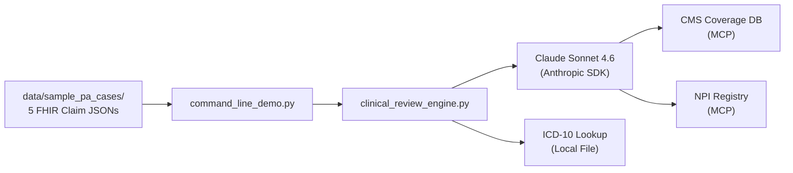

# Build Step 1: Core Clinical Review Engine

> **Status: COMPLETED** — All implementation, tests, and UAT passed. Tagged `v0.1.0`.
>
> **Prerequisites**: Read `shared-context.md` first (includes Claude Code automation reference). Coding standards, FHIR conventions, and architecture rules are auto-loaded from `.claude/rules/`.

**Tag**: `v0.1.0` | **Branch**: `release/step-1-core-engine`
**Dependencies**: `anthropic`, `fhir.resources`, `pydantic-settings`
**Demo mode**: CLI terminal

## What Was Delivered

- Clinical review engine with Claude tool use (5 tools: NPI validation, ICD-10 lookup, CMS coverage, eligibility check, clinical data retrieval)
- 5 realistic PA cases as FHIR R4 Claim bundles (Da Vinci PAS aligned)
- CLI with color-coded output (bash: `make review`/`make review-all`, PowerShell: `python -m prior_auth_demo.command_line_demo --case ...`/`--all`)
- ICD-10-CM 2026 validation from CDC data
- Confidence-based determination routing (auto-approve >= 0.85, human review 0.60-0.84)
- Full test suite: data quality, unit, and e2e tests

## Claude Code Tooling for This Step

| Tool | Usage |
|------|-------|
| **`/brainstorming`** | Before designing the clinical review engine — explore system prompt, tool use patterns, confidence routing |
| **`prior-auth-review@healthcare`** | Invoke for PA workflow patterns: NPI validation, ICD-10 checks, CMS coverage lookup, determination routing |
| **`fhir-developer@healthcare`** | Invoke when creating the 5 FHIR Claim bundles and ClinicalReviewResult model — ensures R4B compliance |
| **`context7`** | Use for Anthropic SDK tool use docs: `use context7 for anthropic python SDK tool use` |
| **`context7`** | Use for fhir.resources docs: `use context7 for fhir.resources R4B` |
| **`/tdd`** | Write `test_data_quality.py` and `test_clinical_review_engine.py` before implementation |
| **MCP: `cms-coverage-db`** | Wire into engine as Claude tool — LCD/NCD coverage criteria lookups |
| **MCP: `npi-registry`** | Wire into engine as Claude tool — provider NPI validation |
| **MCP: `icd10-codes`** | Wire into engine as Claude tool — ICD-10-CM/PCS code validation (supplements local CDC file) |
| **`/simplify`** | After writing engine and CLI code |
| **`/verification-before-completion`** | Run `make lint && make test-unit && make test-e2e` before claiming done |
| **`/code-review`** | Before commit gate |
| **`/commit`** | For the v0.1.0 tag and release branch |

## Architecture



## Implementation

### 1.1: Project scaffolding

Create `pyproject.toml`:
```toml
[project]
name = "prior-auth-demo"
version = "0.1.0"
requires-python = ">=3.12"
dependencies = [
    "anthropic",
    "fhir.resources>=8.0.0",
    "pydantic-settings",
]

[project.optional-dependencies]
dev = ["pytest", "pytest-asyncio", "polyfactory", "ruff"]
```

Create `Makefile`:
```makefile
install:
	pip install -e ".[dev]"
test:
	pytest tests/ -v
lint:
	ruff check src/ tests/
format:
	ruff format src/ tests/
review:
	python -m prior_auth_demo.command_line_demo --case data/sample_pa_cases/01_lumbar_mri_clear_approval.json
review-all:
	python -m prior_auth_demo.command_line_demo --all
```

### 1.2: Create application settings

`src/prior_auth_demo/application_settings.py`:
- `pydantic-settings` `BaseSettings` for env var configuration
- Settings: `ANTHROPIC_API_KEY`, `CLAUDE_MODEL_ID` (default: `claude-sonnet-4-6`), `AUTO_APPROVE_CONFIDENCE_THRESHOLD` (default: `0.85`), `HUMAN_REVIEW_CONFIDENCE_THRESHOLD` (default: `0.60`)
- Load from `.env` file or environment variables

### 1.3: Create the 5 sample PA cases

Create `data/sample_pa_cases/` with 5 FHIR R4 `Claim` resources (`use: "preauthorization"`). Each file is a valid FHIR Bundle containing a Claim plus supporting resources (Patient, Practitioner, Coverage, Condition).

**Case 1: `01_lumbar_mri_clear_approval.json`** — EXPECTED: APPROVED
- Patient: 52-year-old male, commercial PPO
- Diagnosis: `M54.5` (Low back pain), `M54.41` (Sciatica, right side)
- Procedure: `72148` (MRI lumbar spine without contrast)
- Clinical evidence: 8 weeks PT (12 sessions), NSAIDs 6 weeks, positive straight leg raise, pain 7/10
- Why approved: Meets imaging guidelines — conservative treatment failure with radiculopathy

**Case 2: `02_cosmetic_rhinoplasty_denial.json`** — EXPECTED: DENIED
- Patient: 34-year-old female, commercial HMO
- Diagnosis: `L57.0` (Actinic keratosis — mismatched diagnosis)
- Procedure: `30400` (Rhinoplasty, primary)
- Clinical evidence: "Patient desires improvement in nasal appearance." No functional indication.
- Why denied: Cosmetic, diagnosis-procedure mismatch, no documentation of nasal obstruction

**Case 3: `03_spinal_fusion_complex_review.json`** — EXPECTED: PENDED_FOR_REVIEW
- Patient: 61-year-old male, Medicare Advantage
- Diagnosis: `M47.816` (Spondylosis, lumbar), `M48.06` (Spinal stenosis, lumbar), `E11.9` (Type 2 diabetes)
- Procedure: `22612` (Lumbar arthrodesis), `22614` (additional interspace), `22842` (instrumentation)
- Clinical evidence: MRI showing moderate stenosis, EMG with mild radiculopathy, but only 8 PT sessions (below 12 threshold), no ESI attempted, BMI 34, A1C 8.2%
- Why pended: Ambiguous — some criteria met, key gaps in conservative treatment and surgical risk factors

**Case 4: `04_humira_missing_documentation.json`** — EXPECTED: PENDED_MISSING_INFO
- Patient: 45-year-old female, commercial EPO
- Diagnosis: `M05.79` (Rheumatoid arthritis with RF, multiple sites)
- Procedure: `J0135` (Adalimumab/Humira injection)
- Clinical evidence: RA confirmed, "failed methotrexate" mentioned but no dose/duration/labs
- Why pended: Missing step therapy details, lab results (RF, anti-CCP, ESR, CRP), DAS28 score, biosimilar consideration

**Case 5: `05_keytruda_urgent_oncology.json`** — EXPECTED: APPROVED (urgent)
- Patient: 68-year-old male, Medicare Advantage
- Diagnosis: `C34.11` (Malignant neoplasm upper lobe right lung), `C77.1` (Secondary malignant neoplasm intrathoracic lymph nodes)
- Procedure: `J9271` (Pembrolizumab/Keytruda injection)
- Priority: URGENT
- Clinical evidence: Biopsy-confirmed NSCLC, PD-L1 ≥50%, ECOG 1, no EGFR/ALK mutations, meets NCCN Category 1
- Why approved: Clear NCCN guideline match, urgent oncology, 72-hour SLA per CMS-0057-F

### 1.4: Download ICD-10 reference data

Download ICD-10-CM 2026 code descriptions from CDC FTP. Create curated subset (`data/reference/icd10cm_codes_2026.tsv`) containing at minimum the codes used in the 5 sample cases plus related codes. Implement a simple lookup function in the engine.

### 1.5: Build the clinical review engine

`src/prior_auth_demo/clinical_review_engine.py`:

- Main function: `async def review_prior_auth_request(claim: Claim) -> ClinicalReviewResult`
- Uses Anthropic SDK with **tool use** pattern (not just prompt-and-response):
  - Tool: `validate_npi` — calls NPI Registry MCP or validates format locally
  - Tool: `lookup_icd10_code` — validates diagnosis code against CDC data, returns description
  - Tool: `check_cms_coverage` — looks up coverage criteria from CMS Coverage Database via MCP
  - Tool: `retrieve_clinical_data` — fetches patient records from FHIR server (Build Step 2+; in Step 1, reads from the supporting resources in the Claim bundle)
- Claude receives the PA case + tool results and produces a structured determination
- Use structured output (JSON mode or tool_use response) to ensure parseable results
- Apply confidence thresholds: ≥0.85 auto-approve, 0.60-0.84 human review, <0.60 pend
- System prompt should instruct Claude to:
  - Act as a clinical reviewer for a US health plan
  - Evaluate medical necessity against coverage criteria
  - Cite specific clinical evidence and guideline references
  - Assign a confidence score reflecting certainty
  - Never auto-deny — low confidence routes to human review
  - Return structured JSON matching `ClinicalReviewResult` schema

### 1.6: Build the CLI

`src/prior_auth_demo/command_line_demo.py`:
- `python -m prior_auth_demo.command_line_demo --case <path>` (single case)
- `python -m prior_auth_demo.command_line_demo --all` (all 5 cases)
- Pretty-print: color-coded determination badge (green=approved, red=denied, yellow=pended), confidence %, rationale, citations, missing docs if pended, processing time

### 1.7: Write tests

`tests/test_data_quality.py` (`@pytest.mark.unit`):
- `test_all_sample_cases_parse_as_valid_fhir_bundles`
- `test_all_claims_have_preauthorization_use`
- `test_all_diagnosis_codes_are_valid_icd10`
- `test_all_bundles_contain_required_resources` (Patient, Practitioner, Coverage, Condition)
- `test_no_phi_in_data_files` (scan for SSN patterns)

`tests/test_clinical_review_engine.py` (`@pytest.mark.unit`):
- `test_clinical_review_result_model_validation` (polyfactory)
- `test_icd10_lookup_returns_correct_description` (M54.5 → "Low back pain")
- `test_icd10_lookup_returns_none_for_invalid_code`
- `test_confidence_routing_auto_approve` (0.90 → APPROVED)
- `test_confidence_routing_human_review` (0.70 → PENDED_FOR_REVIEW)
- `test_confidence_routing_low_confidence` (0.40 → PENDED_FOR_REVIEW, never auto-deny)

`tests/test_e2e_clinical_review.py` (`@pytest.mark.e2e`, requires ANTHROPIC_API_KEY):
- `test_case_01_lumbar_mri_returns_approved` (confidence >= 0.70)
- `test_case_02_rhinoplasty_returns_denied` ("cosmetic" in rationale)
- `test_case_03_spinal_fusion_returns_pended_review`
- `test_case_04_humira_returns_pended_missing_info` (missing_documentation non-empty)
- `test_case_05_keytruda_returns_approved` ("NCCN" or "oncology" in rationale)
- `test_all_cases_return_within_60_seconds`
- `test_all_cases_have_nonempty_guideline_citations`

## User Stories

| ID | Story | Acceptance Criteria |
|---|---|---|
| US-1.1 | As a **clinical reviewer**, I submit a PA case and receive an AI determination. | FHIR Claim JSON → ClinicalReviewResult within 60s with determination, confidence, rationale, citations. |
| US-1.2 | As a **clinical reviewer**, I want evidence-backed reasoning. | Rationale ≥ 2 sentences AND guideline_citations non-empty. |
| US-1.3 | As a **medical director**, ambiguous cases route to human review. | Confidence < 0.85 → PENDED_FOR_REVIEW or PENDED_MISSING_INFO, never DENIED. |
| US-1.4 | As a **compliance officer**, denials include specific reasons. | DENIED → clinical_rationale explains the specific clinical reason. |
| US-1.5 | As a **provider**, missing-info cases list exactly what's needed. | PENDED_MISSING_INFO → missing_documentation non-empty with specific items. |

## Automated Test Suite

**Bash:**

```bash
make lint                # ~5 sec
make test-data-quality   # ~2 sec, no API key
make test-unit           # ~3 sec, no API key
make test-e2e            # ~5 min, needs ANTHROPIC_API_KEY
```

**PowerShell:**

```powershell
ruff check src/prior_auth_demo/ tests/                  # ~5 sec
ruff format --check src/prior_auth_demo/ tests/
mypy src/prior_auth_demo/
pytest tests/test_data_quality.py -v                     # ~2 sec, no API key
pytest tests/ -m unit -v                                 # ~3 sec, no API key
pytest tests/ -m e2e -v --timeout=300                    # ~5 min, needs ANTHROPIC_API_KEY
```

AI architecture review (Claude Code subagent): type hints, no bare exceptions, no hardcoded secrets, FHIR model usage, architecture alignment.

## Paul's UAT Checklist

**What Changed**: CLI tool + 5 PA cases + Claude tool use + ICD-10 validation + FHIR R4B models.
**Prerequisites**: Install deps (bash: `make install` / PowerShell: `pip install -e ".[dev]" && pre-commit install`), `ANTHROPIC_API_KEY` in `.env`

| # | Action | Expected |
|---|--------|----------|
| 1 | Run single case (bash: `make review` / PowerShell: `python -m prior_auth_demo.command_line_demo --case data/sample_pa_cases/01_lumbar_mri_clear_approval.json`) | Case 1: green APPROVED, confidence ≥ 80%, mentions "conservative treatment" or "radiculopathy" |
| 2 | Run all cases (bash: `make review-all` / PowerShell: `python -m prior_auth_demo.command_line_demo --all`) | 5 cases: approval (1,5), denial (2), pended (3,4) |
| 3 | Read Case 2 | Mentions "cosmetic" AND "diagnosis mismatch" or "no functional indication" |
| 4 | Read Case 3 | Mentions PT gap, no ESI, BMI, or A1C. PENDED_FOR_REVIEW, not DENIED. |
| 5 | Read Case 4 | missing_documentation has 2+ specific items (methotrexate dose, labs, DAS28) |
| 6 | Read Case 5 | Mentions NCCN, PD-L1, or oncology. Confidence ≥ 80%. Notes urgency. |
| 7 | Open `01_lumbar_mri_clear_approval.json` | Valid JSON, `use: "preauthorization"`, ICD-10 codes visible |
| 8 | Check timing | Each case < 60 seconds |

## Commit Gate

```bash
git add -A && git commit -m "Step 1: Core clinical review engine with CLI demo

- Anthropic SDK + Claude tool use for PA clinical review
- 5 realistic PA cases with real ICD-10/CPT codes (Da Vinci PAS aligned)
- FHIR R4B data models via fhir.resources
- CLI with color-coded output
- ICD-10 validation from CDC 2026 data
- Confidence-based determination routing"
git tag -a v0.1.0 -m "Step 1: Core clinical review engine — CLI demo-able"
git checkout -b release/step-1-core-engine
git checkout main
```
