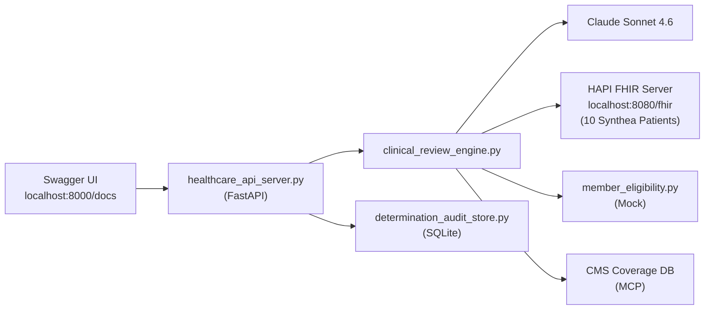

# Build Step 2: REST API with Real FHIR Server

> **Status: COMPLETED** — All implementation, tests, and UAT passed. Tagged `v0.2.0`.
>
> **Prerequisites**: Step 1 complete. Read `shared-context.md` for service contracts and Claude Code automation. Rules auto-loaded from `.claude/rules/`.

**Tag**: `v0.2.0` | **Branch**: `release/step-2-api-service`
**New dependencies**: `fastapi`, `uvicorn`, `httpx`, `aiosqlite`
**New infrastructure**: HAPI FHIR Server (Docker), SQLite
**Demo mode**: Swagger UI in browser

## What Was Delivered

- FastAPI REST API with full Swagger documentation at `/docs`
- HAPI FHIR server (Docker, v7.6.0) with 10 Synthea patients loaded
- Clinical data retrieval from real FHIR R4 server (Conditions, Observations, Procedures)
- SQLite append-only audit trail (`determination_audit_store.py`)
- Mock member eligibility service (FHIR CoverageEligibilityResponse)
- Sample case browser endpoints (`/api/v1/prior-auth/sample-cases`)
- Health check endpoint with FHIR server connectivity reporting
- Graceful fallback: engine works without Docker (CLI always functional)

## Claude Code Tooling for This Step

| Tool | Usage |
|------|-------|
| **`/brainstorming`** | Before API design — explore endpoint structure, error handling, FHIR server integration |
| **`/feature-dev`** | Structured implementation of API server, audit store, and FHIR integration |
| **`context7`** | Use for FastAPI docs: `use context7 for fastapi` — async endpoints, dependency injection, OpenAPI |
| **`context7`** | Use for httpx docs: `use context7 for httpx` — async client for FHIR server calls |
| **`fhir-developer@healthcare`** | FHIR server queries, Bundle parsing, CoverageEligibilityResponse creation |
| **MCP: `docker-mcp`** | Manage HAPI FHIR container — `docker compose up`, health checks, data loading |
| **`/tdd`** | Write API tests, audit store tests, FHIR integration tests before implementation |
| **`/dispatching-parallel-agents`** | Sub-steps 2.3 (API), 2.4 (eligibility mock), and 2.5 (audit store) are independent — build in parallel |
| **`/simplify`** | After each major file (API server, audit store, eligibility mock) |
| **`/verification-before-completion`** | Run full test suite including `make test-integration` with Docker services |
| **`/code-review`** | Before commit gate — check async patterns, SQL injection safety, FHIR compliance |
| **`/commit`** | For the v0.2.0 tag and release branch |

## Architecture



## Implementation

### 2.1: Add dependencies to pyproject.toml

Add: `fastapi`, `uvicorn`, `httpx`, `aiosqlite`

### 2.2: Set up HAPI FHIR Server with Synthea data

Create `docker-compose.yml`:
```yaml
services:
  fhir-server:
    image: hapiproject/hapi:latest
    ports:
      - "8080:8080"
    environment:
      - hapi.fhir.default_encoding=json
```

Download SMART on FHIR 10-patient sample dataset. Create Makefile targets:
```makefile
download-synthea:
	curl -L -o data/synthea_fhir_patients/synthea-10.zip \
	  https://github.com/smart-on-fhir/sample-bulk-fhir-datasets/archive/refs/heads/10-patients.zip
	unzip data/synthea_fhir_patients/synthea-10.zip -d data/synthea_fhir_patients/
load-fhir-data:
	python scripts/load_synthea_to_fhir.py
```

### 2.3: Build the FastAPI server

> **IMPORTANT**: The API server must NOT break the CLI. The engine module (`clinical_review_engine.py`) must remain importable and functional without FastAPI running. The CLI (`command_line_demo.py`) calls the engine directly — it never goes through the API.

`src/prior_auth_demo/healthcare_api_server.py`:

```
POST /api/v1/prior-auth/review         → ClinicalReviewResult (200, 422, 500)
GET  /api/v1/prior-auth/determinations/{id}  → Stored ClinicalReviewResult
GET  /api/v1/prior-auth/determinations       → Paginated list
GET  /api/v1/prior-auth/sample-cases         → List of case filenames
GET  /api/v1/prior-auth/sample-cases/{name}  → FHIR Claim JSON
GET  /health                                 → {"status", "fhir_server", "version"}
```

Mount the mock eligibility service as a sub-router.

### 2.4: Build the mock member eligibility service

`src/prior_auth_demo/mock_healthcare_services/member_eligibility.py`:
- FastAPI router at `/mock/eligibility`
- `POST /mock/eligibility/check` — accepts member_id, returns FHIR `CoverageEligibilityResponse`
- Hard-coded responses for 5 sample case member IDs (all eligible)
- Default: eligible with generic commercial PPO coverage
- ~30 lines. Keep minimal.

### 2.5: Build the audit store

`src/prior_auth_demo/determination_audit_store.py`:
- SQLite at `data/audit_trail.db`
- Table: `determinations` (id, created_at, case_name, determination, confidence_score, clinical_rationale, guideline_citations, processing_time_seconds, full_request_json, full_response_json)
- Functions: `store_determination(...)`, `get_determination(id)`, `list_determinations(limit, offset)`
- Append-only: no update or delete operations

### 2.6: Update engine for FHIR server

> **IMPORTANT**: The engine's `retrieve_clinical_data()` function already extracts data from the Bundle. The FHIR server integration should be an ADDITIONAL data source, not a replacement. When the FHIR server is available, merge its data with bundle-embedded data. When unavailable, the engine must still work with bundle data alone. This ensures the CLI always works without Docker.

Update `clinical_review_engine.py`:
- Accept optional `fhir_server_url` parameter
- When available, retrieve Conditions, Observations, Procedures via `httpx.AsyncClient`
- Pass clinical context to Claude alongside PA case
- Fall back to bundle-embedded data if FHIR server unavailable

### 2.7: Update Makefile

```makefile
up:
	docker compose up -d
down:
	docker compose down
dev:
	uvicorn prior_auth_demo.healthcare_api_server:app --reload --port 8000
```

### 2.8: Write tests

`tests/test_healthcare_api_server.py` (`@pytest.mark.integration`):
- `test_health_endpoint_returns_200`
- `test_health_reports_fhir_server_connected`
- `test_sample_cases_endpoint_returns_5_cases`
- `test_sample_case_endpoint_returns_valid_fhir`
- `test_invalid_fhir_input_returns_422`
- `test_post_review_returns_valid_result`

`tests/test_determination_audit_store.py` (`@pytest.mark.unit`):
- `test_store_and_retrieve_determination`
- `test_list_determinations_returns_stored_results`
- `test_audit_store_is_append_only` (no update/delete functions)
- `test_audit_store_creates_db_if_missing`

`tests/test_fhir_server_integration.py` (`@pytest.mark.integration`):
- `test_fhir_server_is_reachable`
- `test_synthea_patients_loaded`
- `test_fhir_conditions_queryable`
- `test_fhir_observations_queryable`

`tests/test_e2e_api_review.py` (`@pytest.mark.e2e`):
- `test_full_review_flow_via_api` (POST case 1 → APPROVED → GET by ID → verify stored)
- `test_all_5_cases_via_api_produce_expected_determinations`
- `test_audit_trail_contains_all_reviewed_cases`

## User Stories

| ID | Story | Acceptance Criteria |
|---|---|---|
| US-2.1 | REST API accepts PA cases and returns determinations. | POST FHIR Claim → ClinicalReviewResult JSON, status 200. |
| US-2.2 | Every determination stored in immutable audit trail. | Stored in SQLite, retrievable via GET, no update/delete ops exist. |
| US-2.3 | AI retrieves real clinical data from FHIR server. | Engine queries HAPI FHIR for Conditions, Observations, Procedures. |
| US-2.4 | Auto-generated API documentation. | /docs renders Swagger UI with all endpoints and schemas. |
| US-2.5 | Health check endpoint for monitoring. | GET /health → status, fhir_server connectivity, version. |

## Automated Test Suite

**Bash:**

```bash
make up && make load-fhir-data   # Start infrastructure
make lint
make test-data-quality
make test-unit                    # Includes audit store tests
make test-integration             # FHIR server + API endpoints
make test-e2e                     # Full API review flow
```

**PowerShell:**

```powershell
docker compose up -d
python -m prior_auth_demo.mock_healthcare_services.load_fhir_data
ruff check src/prior_auth_demo/ tests/
ruff format --check src/prior_auth_demo/ tests/
mypy src/prior_auth_demo/
pytest tests/test_data_quality.py -v
pytest tests/ -m unit -v                                 # Includes audit store tests
pytest tests/ -m integration -v                          # FHIR server + API endpoints
pytest tests/ -m e2e -v --timeout=300                    # Full API review flow
```

AI review: API error handling, FHIR models, audit append-only, no SQL injection, async patterns.

## Paul's UAT Checklist

**What Changed**: FastAPI REST API + HAPI FHIR + SQLite audit trail + mock eligibility + Swagger docs.
**Prerequisites**: `make up && make load-fhir-data`, `ANTHROPIC_API_KEY` set

| # | Action | Expected |
|---|--------|----------|
| 1 | Open `http://localhost:8080` | HAPI FHIR welcome page |
| 2 | Click "Patient" in HAPI FHIR | Synthea patients visible (synthetic names) |
| 3 | Open `http://localhost:8000/docs` | Swagger UI with all endpoints |
| 4 | GET /api/v1/prior-auth/sample-cases | JSON list of 5 case filenames |
| 5 | GET /health | `{"status": "healthy", "fhir_server": "connected", "version": "0.2.0"}` |
| 6 | POST /api/v1/prior-auth/review (Case 1) | APPROVED within 60s with confidence, rationale, citations |
| 7 | GET /api/v1/prior-auth/determinations | List with case from step 6 |
| 8 | POST Case 3 (spinal fusion) | PENDED_FOR_REVIEW, mentions clinical gaps |
| 9 | GET /determinations again | 2 entries with full audit data |
| 10 | `sqlite3 data/audit_trail.db "SELECT determination, confidence_score FROM determinations;"` | Same 2 determinations |

## Commit Gate

```bash
git add -A && git commit -m "Step 2: REST API with HAPI FHIR server and audit trail

- FastAPI REST API with Swagger documentation
- HAPI FHIR server (Docker) with 10 Synthea patients loaded
- Clinical data retrieval from real FHIR R4 server
- SQLite audit trail (append-only)
- Mock member eligibility service (FHIR CoverageEligibilityResponse)
- Sample case browser endpoints"
git tag -a v0.2.0 -m "Step 2: REST API — demo-able via Swagger UI"
git checkout -b release/step-2-api-service
git checkout main
```
