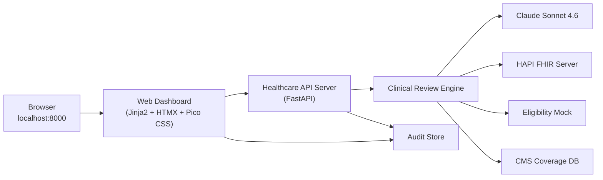

# Build Step 3: Web Dashboard and Presentation Polish

> **Prerequisites**: Step 2 complete. Read `shared-context.md` for service contracts and Claude Code automation. Rules auto-loaded from `.claude/rules/`.

**Tag**: `v0.3.0` | **Branch**: `release/step-3-web-dashboard`
**New dependencies**: `jinja2`, `python-multipart`
**Demo mode**: Polished web dashboard at `localhost:8000`

## Claude Code Tooling for This Step

| Tool | Usage |
|------|-------|
| **`/brainstorming`** | Before dashboard design — explore layout, color palette, executive-readability, projector optimization |
| **`/frontend-design`** | Invoke for the dashboard template — polished, presentation-grade Jinja2+HTMX+Pico CSS layout. Must look professional on a projector at 1920x1080. Color-coded determination badges, confidence bars, clean typography. |
| **`context7`** | Use for HTMX docs: `use context7 for htmx` — hx-post, hx-target, hx-swap, hx-trigger patterns |
| **`context7`** | Use for Pico CSS docs: `use context7 for picocss` — semantic HTML styling, color schemes |
| **`context7`** | Use for Jinja2 docs: `use context7 for jinja2` — template inheritance, filters, macros |
| **`fhir-developer@healthcare`** | Rendering FHIR ClaimResponse data in human-readable format for the dashboard |
| **`/tdd`** | Write dashboard HTML tests before building the template |
| **`/simplify`** | After dashboard routes and template |
| **`security-guidance`** | No XSS in templates — ensure all dynamic content is escaped, no inline JS |
| **`/verification-before-completion`** | Test dashboard renders, Swagger still works, all API endpoints intact |
| **`/code-review`** | Before commit gate — check accessibility, XSS safety, CDN versioning |
| **`/commit`** | For the v0.3.0 tag and release branch |

## Architecture



## Implementation

### 3.1: Add template dependencies

Add to pyproject.toml: `jinja2`, `python-multipart`

### 3.2: Build the web dashboard

`src/prior_auth_demo/web_dashboard/templates/review_dashboard.html`:

Single-page dashboard using Jinja2 + HTMX + Pico CSS (via CDN). No npm. No build step.

Layout:
1. **Header**: "Prior Authorization Review — AI-Driven Clinical Decision Support"
2. **Case Selector** (left): Dropdown of 5 cases with descriptive names. "Submit for Review" button.
3. **Results Panel** (center): Appears after submission via HTMX swap.
   - Determination badge (color-coded: green/red/yellow)
   - Confidence score as progress bar with percentage
   - Clinical rationale (formatted text)
   - Guideline citations (bulleted list)
   - If pended: missing documentation checklist
   - Processing time
4. **History Panel** (right or below): Table of all reviewed cases from audit trail. Auto-refreshes via HTMX polling.
5. **Footer**: "Phase 0 Demo — Full architecture: [link to slides]"

HTMX patterns:
- Submission: `hx-post="/api/v1/prior-auth/review"` with `hx-target="#results-panel"` `hx-swap="innerHTML"`
- History: `hx-get="/api/v1/prior-auth/determinations"` with `hx-trigger="every 10s"`
- Loading: `hx-indicator="#spinner"`

### 3.3: Create dashboard routes

`src/prior_auth_demo/web_dashboard/dashboard_routes.py`:
- `GET /` — renders dashboard template
- Template context: sample case list, determination history

### 3.4: Mount dashboard on API server

> **IMPORTANT**: The dashboard routes must be additive — they must NOT modify or shadow existing API routes. The `/api/v1/...` endpoints, `/docs` (Swagger), and `/health` must all continue to work exactly as in Step 2. The dashboard adds `/` as a new HTML route. All three entry points (CLI, API, Dashboard) must work simultaneously.

Update `healthcare_api_server.py`:
- Mount `dashboard_routes` router
- Configure Jinja2 template directory
- Root `/` → dashboard; `/api/v1/...` → API; `/docs` → Swagger

### 3.5: Polish for demo walkthrough

- Present cases in demo flow order: 1 → 4 → 3 → 5 → 2
- Add confidence threshold display (0.85)
- Add "Would route to human reviewer" indicator for pended cases
- Professional on a projector (good contrast, large text, 1920x1080)

### 3.6: Write tests

`tests/test_web_dashboard.py` (`@pytest.mark.integration`):
- `test_dashboard_root_returns_200_html`
- `test_dashboard_contains_case_selector` (5 case names in HTML)
- `test_dashboard_contains_htmx_attributes` (`hx-post`, `hx-target`)
- `test_swagger_still_accessible` (GET /docs returns 200)
- `test_api_endpoints_still_work` (GET /health, GET /sample-cases)

`tests/test_e2e_dashboard_flow.py` (`@pytest.mark.e2e`):
- `test_submit_case_via_api_and_verify_in_determinations`
- `test_all_5_cases_via_api_with_audit_trail`

## User Stories

| ID | Story | Acceptance Criteria |
|---|---|---|
| US-3.1 | Web dashboard for live demo. | localhost:8000 shows case selector, submit button, results panel. |
| US-3.2 | Color-coded determinations with confidence bars. | APPROVED=green, DENIED=red, PENDED=yellow + progress bar. |
| US-3.3 | History panel for referencing earlier decisions. | Lists all determinations with case name, determination, confidence, timestamp. |
| US-3.4 | Readable on projector at 1920x1080. | All text readable, badges visible, no horizontal scrolling. |
| US-3.5 | Swagger UI still works alongside dashboard. | /docs renders correctly. |

## Automated Test Suite

```bash
make up && make load-fhir-data
make lint
make test-data-quality
make test-unit
make test-integration    # Includes dashboard HTML checks
make test-e2e
# AI review: no XSS (no unescaped user input), versioned CDN URLs, no inline JS, existing API intact.
```

## Paul's UAT Checklist

**What Changed**: Web dashboard at localhost:8000 — case selector, results panel, history. This is the interview demo surface.
**Prerequisites**: `make up && make load-fhir-data`, `make dev` running

| # | Action | Expected |
|---|--------|----------|
| 1 | Open `http://localhost:8000` | Dashboard loads, case selector visible, no errors in console |
| 2 | Submit "Lumbar MRI — Clear Approval" | Loading spinner → green APPROVED, confidence ≥ 80%, rationale, citations |
| 3 | Read Case 1 rationale | Professional, clinical. Mentions "conservative treatment failure" or "radiculopathy". |
| 4 | Submit Case 4 (Humira) | Yellow PENDED. Missing docs list: methotrexate dose, labs, DAS28. |
| 5 | Submit Case 3 (Spinal Fusion) | Yellow PENDED_FOR_REVIEW. Identifies specific clinical gaps. |
| 6 | Submit Case 5 (Keytruda) | Green APPROVED. Mentions NCCN, PD-L1, or urgency. |
| 7 | Submit Case 2 (Rhinoplasty) | Red DENIED. Mentions "cosmetic", "diagnosis mismatch". |
| 8 | Check history panel | All 5 determinations listed in order. |
| 9 | Fullscreen at 1920x1080 | All text readable, no horizontal scroll, badges clear. |
| 10 | Open `http://localhost:8000/docs` | Swagger UI intact. |
| 11 | **Practice demo walkthrough** (see `docs/presentation/speaker-script.md`) | All 5 cases in order 1→4→3→5→2, 5-6 minutes total. |

**Special note on step 11**: This is your dress rehearsal. If any case takes >45s or gives unexpected results, re-run — LLM outputs vary.

## Commit Gate

```bash
git add -A && git commit -m "Step 3: Web dashboard with HTMX for interview demo

- Jinja2 + HTMX + Pico CSS dashboard (no npm, no build step)
- Case selector with 5 realistic PA scenarios
- Color-coded determination display with confidence visualization
- Auto-refreshing determination history panel
- Presentation-optimized layout"
git tag -a v0.3.0 -m "Step 3: Web dashboard — interview-ready local demo"
git checkout -b release/step-3-web-dashboard
git checkout main
```
