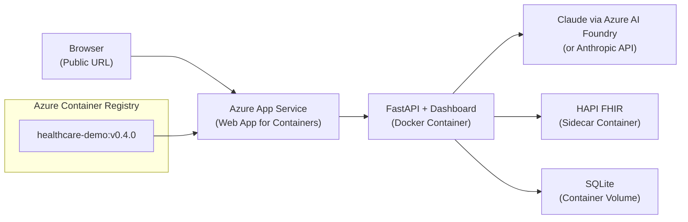

# Build Step 4: Azure Cloud Deployment

> **Status: READY** — Steps 1-3 complete. This is the next step to implement.
>
> **Prerequisites**: Step 3 complete. Read `shared-context.md` for version control strategy and Claude Code automation. Rules auto-loaded from `.claude/rules/`.

**Tag**: `v0.4.0` | **Branch**: `release/step-4-azure-deploy`
**New files**: `Dockerfile`, `.github/workflows/deploy-azure.yml`
**Demo mode**: Live public URL on Azure

## What Exists So Far

Steps 1-3 delivered a fully working local demo:
- **Step 1**: CLI review engine with 5 PA cases, Claude tool use, ICD-10 validation
- **Step 2**: FastAPI REST API, HAPI FHIR server (Docker), SQLite audit trail
- **Step 3**: Web dashboard (Jinja2 + HTMX + Pico CSS) at `localhost:8000`

All three entry points (CLI, Swagger UI, Dashboard) are functional. The `docker-compose.yml` already runs HAPI FHIR. This step adds containerization of the app itself and Azure deployment.

## What Remains

1. **Dockerfile** for the FastAPI application (sub-step 4.1)
2. **docker-compose.yml update** to include the app container alongside HAPI FHIR (sub-step 4.2)
3. **Azure Container Registry** push (sub-step 4.3)
4. **Azure App Service** deployment (sub-step 4.4)
5. **GitHub Actions CI/CD** workflow — optional (sub-step 4.5)

## Claude Code Tooling for This Step

| Tool | Usage |
|------|-------|
| **`/feature-dev`** | Structured implementation of Dockerfile, compose, Azure deployment |
| **MCP: `docker-mcp`** | Build and test Docker image locally, manage compose stack, verify container health |
| **`context7`** | Use for Docker docs: `use context7 for docker` — multi-stage builds, security best practices |
| **`security-guidance`** | Container security — non-root user, no secrets in image, minimal attack surface |
| **`/verification-before-completion`** | Test Docker build locally, curl health endpoint, verify dashboard in container |
| **`/code-review`** | Before commit gate — Dockerfile security, compose config, GitHub Actions workflow |
| **`/commit`** | For the v0.4.0 tag and release branch |

**Note**: Azure CLI commands (`az`) run via Bash tool. Paul may need to authenticate (`az login`) manually if not already logged in.

## Architecture



## Implementation — Risk Minimization

4 independently verifiable sub-steps. If any fails, previous sub-steps still work. Step 3 (local demo) is the safe fallback.

### 4.1: Create Dockerfile (verify locally)

```dockerfile
FROM python:3.12-slim
WORKDIR /app
COPY pyproject.toml .
RUN pip install --no-cache-dir .
COPY src/ src/
COPY data/ data/
RUN adduser --disabled-password --gecos '' appuser && chown -R appuser /app
USER appuser
EXPOSE 8000
CMD ["fastapi", "run", "src/prior_auth_demo/healthcare_api_server.py", "--host", "0.0.0.0", "--port", "8000"]
```

Verify locally:
```bash
docker build -t healthcare-demo:local .
docker run -p 8000:8000 -e ANTHROPIC_API_KEY=$ANTHROPIC_API_KEY healthcare-demo:local
# Open http://localhost:8000 — verify dashboard works
```

### 4.2: Update docker-compose.yml for full local stack

```yaml
services:
  app:
    build: .
    ports:
      - "8000:8000"
    environment:
      - ANTHROPIC_API_KEY=${ANTHROPIC_API_KEY}
      - FHIR_SERVER_URL=http://fhir-server:8080/fhir
    depends_on:
      - fhir-server
  fhir-server:
    image: hapiproject/hapi:latest
    ports:
      - "8080:8080"
```

### 4.3: Push to Azure Container Registry

```bash
az group create --name rg-healthcare-demo --location eastus2
az acr create --resource-group rg-healthcare-demo --name healthcaredemo --sku Basic
az acr login --name healthcaredemo
docker tag healthcare-demo:local healthcaredemo.azurecr.io/healthcare-demo:v0.4.0
docker push healthcaredemo.azurecr.io/healthcare-demo:v0.4.0
```

### 4.4: Deploy to Azure App Service

```bash
az appservice plan create --name asp-healthcare-demo --resource-group rg-healthcare-demo --is-linux --sku B1
az webapp create --resource-group rg-healthcare-demo --plan asp-healthcare-demo \
  --name autonomize-healthcare-demo \
  --deployment-container-image-name healthcaredemo.azurecr.io/healthcare-demo:v0.4.0
az webapp config appsettings set --resource-group rg-healthcare-demo --name autonomize-healthcare-demo \
  --settings ANTHROPIC_API_KEY=<key> FHIR_SERVER_URL=<url> WEBSITES_PORT=8000
```

**Optional: Claude via Azure AI Foundry** — single-line config change:
```python
client = anthropic.Anthropic(
    base_url="https://<your-foundry-endpoint>.eastus2.models.ai.azure.com",
    api_key=os.environ["AZURE_AI_FOUNDRY_API_KEY"],
)
```

### 4.5: GitHub Actions workflow (optional)

`.github/workflows/deploy-azure.yml` — only if manual deployment worked first. 15 lines: login → build+push → deploy.

## User Stories

| ID | Story | Acceptance Criteria |
|---|---|---|
| US-4.1 | App runs identically in Docker. | `docker compose up --build` → same behavior as Step 3. |
| US-4.2 | Public URL for interview panel. | Azure URL serves dashboard, all 5 cases produce determinations. |
| US-4.3 | Reproducible CI/CD deployment. | Push to main → GitHub Actions → ACR → App Service. |

## Automated Test Suite

**Bash:**

```bash
make lint
docker build -t healthcare-demo:local .
docker compose up --build -d
sleep 10
curl -f http://localhost:8000/health
curl -f http://localhost:8000/docs
curl -f http://localhost:8000/api/v1/prior-auth/sample-cases
make test-integration
curl -X POST http://localhost:8000/api/v1/prior-auth/review \
  -H "Content-Type: application/json" \
  -d @data/sample_pa_cases/01_lumbar_mri_clear_approval.json
# Verify response contains "APPROVED"
docker compose down
```

**PowerShell:**

```powershell
ruff check src/prior_auth_demo/ tests/
ruff format --check src/prior_auth_demo/ tests/
mypy src/prior_auth_demo/
docker build -t healthcare-demo:local .
docker compose up --build -d
Start-Sleep 10
Invoke-WebRequest -Uri http://localhost:8000/health -UseBasicParsing
Invoke-WebRequest -Uri http://localhost:8000/docs -UseBasicParsing
Invoke-WebRequest -Uri http://localhost:8000/api/v1/prior-auth/sample-cases -UseBasicParsing
pytest tests/ -m integration -v
# Verify response contains "APPROVED"
docker compose down
```

## Paul's UAT Checklist

**What Changed**: Dockerfile, docker-compose for full stack, Azure deployment. App runs in containers.
**Prerequisites**: Docker installed, Azure CLI logged in (for cloud steps)

| # | Action | Expected |
|---|--------|----------|
| 1 | `docker compose up --build` | Both containers start, "Application startup complete" in logs |
| 2 | Open `http://localhost:8000` | Dashboard identical to Step 3 |
| 3 | Submit Case 1 via dashboard | APPROVED, same quality as Step 3 |
| 4 | Open `http://localhost:8080` | HAPI FHIR accessible |
| 5 | `docker compose down` then `up` | Restarts cleanly (ephemeral volume = audit trail reset, expected) |
| 6 | **(Azure)** Run deployment commands | Azure portal shows web app running |
| 7 | **(Azure)** Open public URL | Dashboard loads, Case 1 → APPROVED (up to 90s cold start) |
| 8 | **(Azure)** Test from different device | Publicly accessible, no VPN needed |

**Steps 1-5 pass = Step 4 complete.** Azure (6-8) is a bonus. Step 3 is the fallback.

## Commit Gate

```bash
git add -A && git commit -m "Step 4: Docker containerization and Azure App Service deployment

- Single-stage Dockerfile (python:3.12-slim)
- Docker Compose for full local stack (app + HAPI FHIR)
- Azure App Service deployment via ACR
- GitHub Actions CI/CD workflow"
git tag -a v0.4.0 -m "Step 4: Azure deployment — live cloud URL"
git checkout -b release/step-4-azure-deploy
git checkout main
```
