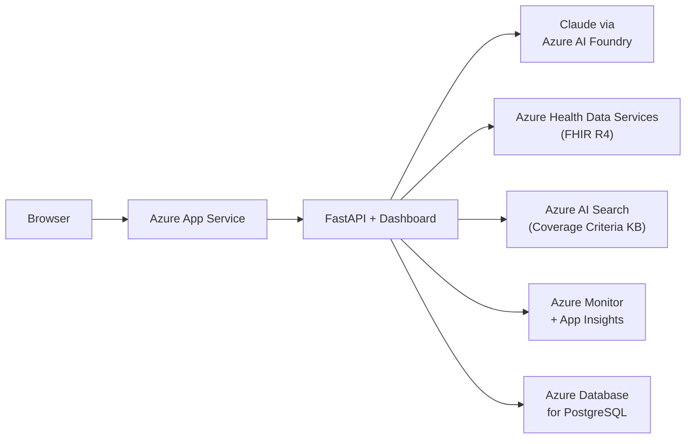

# Build Step 5: Azure Managed Healthcare Services

> **Status: NOT STARTED** — Stretch goal. Depends on Step 4 completion. Step 4 is sufficient for the interview demo.
>
> **Prerequisites**: Step 4 complete. This step is **stretch-only**. If not set up in time, Step 4 is sufficient.

**Tag**: `v0.5.0` | **Branch**: `release/step-5-managed-services`
**Demo mode**: Enterprise-aligned Azure architecture

## Claude Code Tooling for This Step

| Tool | Usage |
|------|-------|
| **`context7`** | Use for Azure SDK docs if using `azure-identity` or `azure-mgmt-*` packages |
| **`/feature-dev`** | Each migration (FHIR, LLM, audit store, monitoring) is an independent sub-task |
| **`/dispatching-parallel-agents`** | All 5 migrations are independent config changes — can parallelize |
| **`/verification-before-completion`** | Run integration and e2e tests against Azure services |
| **`/commit`** | For the v0.5.0 tag and release branch |

**Note**: Each migration is a config swap — no architectural refactoring. If any migration fails, skip it and keep the open-source version.

Migrates from open-source Docker services to Azure managed equivalents, aligning the demo with the enterprise architecture in `docs/architecture/solution-architecture.md`.

## Architecture



## Migration Steps

| Component | Step 4 (Open Source) | Step 5 (Azure Managed) | Effort |
|-----------|---------------------|----------------------|--------|
| FHIR Server | HAPI FHIR (Docker) | Azure Health Data Services FHIR | Swap URL + Azure auth |
| LLM | Anthropic API (direct) | Claude via Azure AI Foundry | Swap base_url + API key |
| Audit Store | SQLite (file) | Azure Database for PostgreSQL | Swap connection string + asyncpg |
| Coverage KB | CMS MCP Server | Azure AI Search (vectorized NCDs) | New indexing pipeline |
| Monitoring | Console logs | Azure Monitor + App Insights | Add OpenTelemetry SDK |

Each migration is an independent config change. No architectural refactoring required.

## User Stories

| ID | Story | Acceptance Criteria |
|---|---|---|
| US-5.1 | Demo uses Azure-managed healthcare services. | Clinical data from Azure Health Data Services, LLM via Azure AI Foundry. |
| US-5.2 | Production-grade observability. | Traces in Azure Monitor, metrics in App Insights. |

## Automated Test Suite

**Bash:**

```bash
# Same suite as Step 4, pointed at Azure services:
make test-integration   # Azure FHIR, Azure AI Foundry connectivity
make test-e2e           # Full review flow through Azure services
```

**PowerShell:**

```powershell
# Same suite as Step 4, pointed at Azure services:
pytest tests/ -m integration -v    # Azure FHIR, Azure AI Foundry connectivity
pytest tests/ -m e2e -v --timeout=300   # Full review flow through Azure services
```

## Paul's UAT Checklist

**What Changed**: Backend swapped to Azure-managed. Same frontend, same API, different infrastructure.

| # | Action | Expected |
|---|--------|----------|
| 1 | Azure Portal: Health Data Services | FHIR service running, Synthea patients loaded |
| 2 | Submit Case 1 via dashboard | APPROVED, same as Steps 3/4 |
| 3 | Azure Monitor | Request traces visible |
| 4 | App Insights | Request count, latency, errors visible |

## Commit Gate

```bash
git add -A && git commit -m "Step 5: Azure managed healthcare services integration

- Azure Health Data Services FHIR (replaces HAPI FHIR)
- Claude via Azure AI Foundry
- Azure Database for PostgreSQL (replaces SQLite)
- Azure Monitor + App Insights observability"
git tag -a v0.5.0 -m "Step 5: Azure managed services — enterprise-aligned"
git checkout -b release/step-5-managed-services
git checkout main
```
