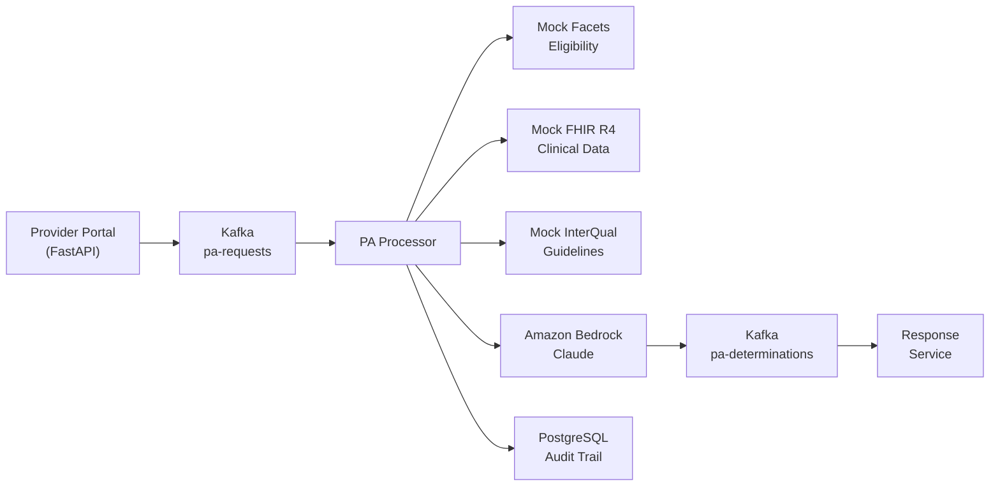

# AI-Driven Prior Authorization Demo

> Autonomize AI interview exercise — event-driven PA automation with FastAPI, Kafka, FHIR R4, and Amazon Bedrock.

## Overview

This demo implements a focused vertical slice of an AI-driven Prior Authorization system. A single PA request flows through the complete pipeline: portal submission, eligibility verification, clinical data retrieval, AI-powered determination, and response delivery.

**Full solution architecture**: [solutions-architecture-agent/outputs/eng-2026-004](https://github.com/praeducer/solutions-architecture-agent)

## Architecture



## Quick Start

### Prerequisites

- Python 3.12+
- Docker and Docker Compose
- AWS credentials configured (for Amazon Bedrock)

### Setup

```bash
# Start infrastructure
docker compose up -d

# Install dependencies
pip install -e ".[dev]"

# Run the application
uvicorn src.main:app --reload --port 8000
```

Or use the Makefile:

```bash
make up && make install && make dev
```

### Submit a PA Request

```bash
curl -X POST http://localhost:8000/pa/submit \
  -H "Content-Type: application/json" \
  -d '{
    "member_id": "MBR-2026-001",
    "provider_npi": "1234567890",
    "diagnosis_codes": ["M54.5"],
    "procedure_codes": ["97110"],
    "service_description": "Physical therapy evaluation and treatment for low back pain",
    "clinical_notes": "Patient presents with chronic low back pain, duration 6 months.",
    "urgency": "standard",
    "lob": "commercial"
  }'
```

## API Endpoints

| Method | Path | Description |
|--------|------|-------------|
| `POST` | `/pa/submit` | Submit a new PA request |
| `GET` | `/pa/status/{request_id}` | Check PA request status |
| `GET` | `/pa/dashboard` | View processing metrics |
| `GET` | `/health` | Health check |

## Tech Stack

| Layer | Technology | Production Equivalent |
|-------|-----------|----------------------|
| API | FastAPI (Python 3.12) | Amazon API Gateway |
| Event Bus | Apache Kafka (KRaft) | Amazon MSK |
| AI | Amazon Bedrock (Claude) | Autonomize AI PA Copilot |
| Database | PostgreSQL 16 | Amazon RDS |
| Clinical Data | Mock FHIR R4 server | AWS HealthLake |
| Eligibility | Mock Facets API | TriZetto Facets |
| Guidelines | Mock InterQual API | InterQual/MCG APIs |

## Demo Scope

This prototype demonstrates the core PA automation concept. It intentionally excludes:

- Fax ingestion / OCR
- X12 278 EDI processing
- Legacy database connectors
- Multi-LOB configuration
- MLOps / drift detection
- Production security hardening
- Multi-AZ deployment

See the [full solution architecture](https://github.com/praeducer/solutions-architecture-agent) for the complete enterprise design.

## Development

```bash
make lint      # Run ruff + mypy
make format    # Auto-format code
make test      # Run tests
make clean     # Remove containers + volumes
```

## Author

**Paul Prae** — [paulprae.com](https://www.paulprae.com) — Modular Earth LLC
