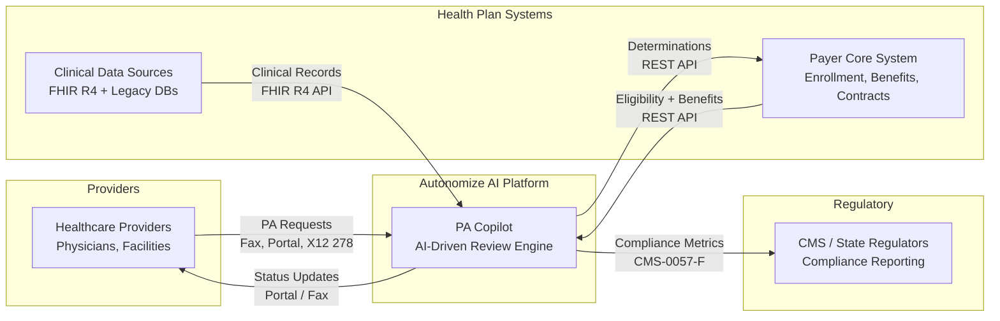

# AI-Driven Prior Authorization Demo

> Proof-of-concept demonstrating AI-driven prior authorization review
> using Claude, FHIR R4, and evidence-based clinical guidelines.
> Built for the [Autonomize AI](https://autonomize.ai/) Solutions Architect
> interview assignment.

**Author**: [Paul Prae](https://www.paulprae.com) — Modular Earth LLC

## Architecture Overview



The full enterprise architecture covers 10 components across 5 layers — ingestion, integration, AI engine, human review, and response — all on Azure-native services with HIPAA/HITRUST compliance.

- [Solution Architecture](docs/architecture/solution-architecture.md) — master reference
- [Presentation Deck](docs/architecture/presentation.md) — 11 slides, priority-tiered
- [Architecture Diagrams](docs/architecture/diagrams/) — 6 progressive views

## Quick Start

```bash
make install        # Install dependencies + pre-commit hooks
make review         # Run a single PA case through AI review (CLI)
make review-all     # Run all 5 PA cases
make dev            # Start the FastAPI server (Phase 2+)
```

## Tech Stack

| Layer | Technology |
|-------|-----------|
| AI Engine | Anthropic SDK + Claude Sonnet 4.6 |
| Clinical Data | FHIR R4 (fhir.resources R4B) + HAPI FHIR Server |
| PA Standard | Da Vinci PAS IG (FHIR Claim/ClaimResponse) |
| Reference Data | CMS Coverage DB (MCP), NPI Registry (MCP), CDC ICD-10-CM |
| API | FastAPI + Pydantic v2 |
| Web UI | Jinja2 + HTMX + Pico CSS |
| Audit | SQLite (append-only) |
| Config | pydantic-settings |

## Project Structure

```
src/prior_auth_demo/
├── clinical_review_engine.py         # Core AI: Claude + tool use -> determination
├── command_line_demo.py              # CLI entry point
├── healthcare_api_server.py          # FastAPI REST API
├── application_settings.py           # Environment configuration
├── determination_audit_store.py      # SQLite audit trail
├── mock_healthcare_services/         # Mock payer services
└── web_dashboard/                    # Jinja2 + HTMX dashboard
```

## Implementation Phases

| Phase | Deliverable | Tag |
|-------|------------|-----|
| 0 | Repo preparation | v0.0.1 |
| 1 | CLI review engine + 5 PA cases | v0.1.0 |
| 2 | FastAPI + HAPI FHIR + audit store | v0.2.0 |
| 3 | Web dashboard (Jinja2 + HTMX) | v0.3.0 |
| 4 | Docker + Azure deployment | v0.4.0 |
| 5 | Azure-native services | v0.5.0 |

Each phase is independently demo-able. Decision gates between phases use real performance data.

## Documentation

All deliverables in [docs/](docs/README.md):

| Section | Contents |
|---------|----------|
| [Architecture](docs/architecture/) | Solution design, presentation, speaker notes, research, diagrams |
| [Interview Prep](docs/interview-prep/) | Study guide, Q&A reference, checklist, panel email |
| [Inputs](docs/inputs/) | Assignment, stakeholder profiles, job description |
| [Plans](docs/plans/) | Design doc, execution log, technical decisions |

## License

MIT — see [LICENSE](LICENSE)
