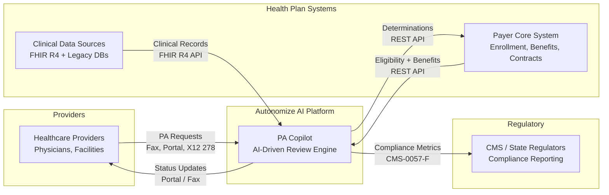
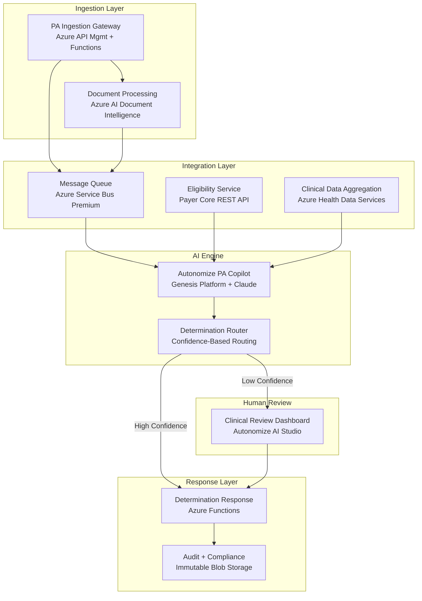
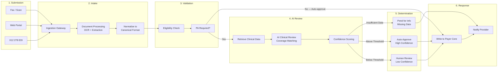

# AI-Driven Prior Authorization — Solution Architecture
## Autonomize AI | Paul Prae | www.paulprae.com

> 11 slides | Priority-tiered for conversational format | Under 30 minutes
>
> **Tier A** (Must Present): Slides 1-6 | **Tier B** (If Time): Slides 7-9 | **Tier C** (Appendix): Slides 10-11

---

## Slide 1: Title & Introduction

# AI-Driven Prior Authorization
### Solution Architecture for a Large US Health Plan

**Paul Prae** | Principal AI Engineer & Architect
www.paulprae.com

---

## Slide 2: Why This Architecture

**The Problem:** Manual PA processing costs **$10.97 in labor per provider transaction** ([CAQH 2024 Index, Prior Authorization row](https://www.caqh.org/hubfs/Index/2024%20Index%20Report/CAQH_IndexReport_2024_FINAL.pdf)), takes days, and burns out clinical staff — **93% of physicians** say PA delays patient care ([AMA 2024 Survey, p. 5](https://www.ama-assn.org/system/files/prior-authorization-survey.pdf)).

**The Opportunity — Altais + Autonomize AI** ([BusinessWire Feb 2026](https://www.businesswire.com/news/home/20260224376992/en/Altais-Cuts-Prior-Authorization-Review-Time-by-45-and-Reduces-Manual-Errors-by-54-with-Autonomize-AI)):
- **45%** reduction in PA review time
- **54%** reduction in manual errors
- **50%** auto-determination rate

**This Architecture Delivers:**
- AI-driven clinical review with human oversight
- Configurable confidence thresholds — start conservative, tune with real data
- CMS-0057-F compliance readiness — FHIR R4 foundation meets Jan 2027 deadline
- Azure-native deployment — leverages Autonomize's Azure ecosystem

---

## Slide 3: System Context

| Actor | Role | Integration |
|-------|------|-------------|
| Healthcare Providers | Submit PA requests | Fax, Portal, X12 278 |
| Autonomize AI Platform | AI-driven clinical review | PA Copilot on Genesis |
| Health Plan Systems | Eligibility, benefits, clinical data | REST API, FHIR R4 |
| Regulators (CMS) | Compliance reporting | CMS-0057-F metrics |

---

## Slide 4: Component Architecture

| Component | Azure Service | Purpose |
|-----------|--------------|---------|
| Ingestion Gateway | API Management + Functions | Receives all PA channels |
| Document Processing | AI Document Intelligence | OCR for faxes |
| Eligibility Service | Payer Core REST API | Member validation |
| Clinical Data Aggregation | Health Data Services (FHIR R4) | Unified clinical context |
| PA Copilot | Genesis Platform + Claude | AI clinical review |
| Determination Router | Functions + Rules | Confidence-based routing |
| Clinical Review Dashboard | AI Studio | Human reviewer interface |
| Audit & Compliance | Immutable Blob Storage | Tamper-proof audit trail |

| Azure Service | AWS Equivalent |
|---------------|---------------|
| Azure AI Foundry | Amazon Bedrock |
| Azure Service Bus | Amazon SQS/SNS |
| Azure Container Apps | Amazon ECS |
| Azure Health Data Services | AWS HealthLake |
| Azure AI Search | Amazon OpenSearch |
| Microsoft Entra ID | AWS IAM + Cognito |

---

## Slide 5: PA Request Lifecycle

**6-step process:** Submit → Intake (OCR/extraction) → Validate (eligibility) → AI Review (coverage matching + confidence scoring) → Route (auto-approve / human review / pend) → Respond (payer core writeback + provider notification)

---

## Slide 6: Top 3 Security Risks & Mitigations

| # | Risk | Mitigation |
|---|------|------------|
| 1 | **PHI exposure through AI pipeline** | PHI tokenization before LLM — AI sees clinical facts without patient identity. Enterprise deployment (data not used for training). |
| 2 | **Prompt injection via clinical documents** | Document sanitization + system prompt isolation + output validation requiring evidence citations. |
| 3 | **Untraceable AI decisions** | Tamper-proof audit trail: model version, input hash, reasoning, evidence, confidence. Immutable 7-year retention. |

**Additional controls:** Entra ID RBAC, AES-256 at rest, TLS 1.2+ in transit, private endpoints, no auto-deny without human review.

---

## Slide 7: Clinical Data Integration

| Source | Protocol | Auth |
|--------|----------|------|
| Modern EMRs | FHIR R4 REST API | OAuth 2.0 / SMART on FHIR |
| Legacy Systems | DB connector / HL7 v2 | Service account + VNet |

**FHIR R4 role:** Interoperability standard for clinical data exchange. Modern sources expose it natively. Legacy data normalized to FHIR-compatible format before AI processing. Deep FHIR implementation is a discovery-phase activity with clinical informaticists.

**Security boundary:** All clinical data passes through PHI tokenization layer before reaching the AI engine.

---

## Slide 8: AI Model Monitoring & Feedback

**Detect drift:**
- Outcome monitoring — track overturn rate (human overrides AI), appeal rate, accuracy trends
- Automated evals — golden test cases benchmarked on schedule
- Confidence distribution — shifts signal model or data changes

**Feedback loop:**
1. Human reviewer corrections → updated eval dataset
2. Eval dataset → benchmark new model versions vs current
3. If improved → staged blue-green rollout
4. Guardrails always active: input filtering, output validation, clinical safety

---

## Slide 9: Progressive Delivery

| Phase | Focus | Key Deliverable |
|-------|-------|-----------------|
| **Phase 0: Demo** | Prove the concept | Working AI PA review with mock data |
| **Phase 1: MVP** | Single LOB, single channel | Production PA processing with human review |
| **Phase 2: Scale** | Multi-channel, multi-LOB | Fax OCR, legacy data, LOB configuration |
| **Phase 3: Enterprise** | Full scale, compliance | All channels, 20 LOBs, CMS reporting |

Each phase produces a deployable, demonstrable system. Decision gates between phases use real performance data to scope the next phase.

---

## Slide 10: Scaling to 20 LOBs

| Approach | Cost | Isolation | Complexity |
|----------|------|-----------|------------|
| **Multi-tenant** | Lower | Logical | Lower |
| **Multi-instance** | Higher | Physical | Higher |

**Recommendation:** Start multi-tenant with per-LOB configuration. Autonomize Genesis Platform already supports it. Deploy separate instances only where regulation requires physical isolation.

**Honest unknowns:** The right answer depends on actual LOB rule complexity and regulatory requirements — both are discovery questions.

---

## Slide 11: Discussion Starters

**Business Strategy:**
- How does the ServiceNow partnership change the payer integration strategy?
- What is the target auto-determination rate for Phase 1?

**Technical Depth:**
- How does the Genesis Platform handle coverage criteria updates?
- What's the Azure AI Foundry Agent Service integration status?

**Implementation:**
- Which LOB is the ideal Phase 1 candidate?
- What's been the biggest integration challenge with existing payer deployments?

---

## Sources

| Claim | Source | Notes |
|-------|--------|-------|
| $10.97 manual PA labor cost (provider) | [2024 CAQH Index](https://www.caqh.org/hubfs/Index/2024%20Index%20Report/CAQH_IndexReport_2024_FINAL.pdf), Prior Authorization row | Weighted avg labor cost (salaries + benefits + overhead) per manual transaction; excludes system costs |
| $3.52 manual PA labor cost (payer) | Same | Same methodology, health plan side |
| ~$0.05 electronic PA cost (payer) | Same | Fully electronic transaction |
| 45% review time reduction | [Altais/Autonomize (Feb 2026)](https://www.businesswire.com/news/home/20260224376992/en/Altais-Cuts-Prior-Authorization-Review-Time-by-45-and-Reduces-Manual-Errors-by-54-with-Autonomize-AI) | Press release headline metric |
| 54% error reduction | Same | |
| 50% auto-determination rate | Same | |
| 93% physicians — PA delays care | [AMA 2024 Survey](https://www.ama-assn.org/system/files/prior-authorization-survey.pdf) | Survey of 1,000 practicing physicians, Dec 2024 |
| CMS-0057-F Phase 1 live Jan 2026 | [CMS Fact Sheet](https://www.cms.gov/newsroom/fact-sheets/cms-interoperability-prior-authorization-final-rule-cms-0057-f) | |
| CMS-0057-F Phase 2 Jan 2027 | Same | |
| Autonomize — 3 of top 5 plans | [Autonomize AI](https://autonomize.ai/) | |
| Autonomize Azure Marketplace | [Azure Marketplace](https://azuremarketplace.microsoft.com/en-us/marketplace/apps/284109.autonomize-prior-auth-copilot) | |
| Autonomize ServiceNow partnership | [BusinessWire (Mar 2026)](https://www.businesswire.com/news/home/20260305091710/en/Autonomize-AI-Partners-with-ServiceNow-to-Build-AI-Driven-Healthcare-Solutions-for-Payers) | |
| Claude in Azure AI Foundry | [Microsoft Learn](https://learn.microsoft.com/en-us/azure/foundry/foundry-models/how-to/use-foundry-models-claude) | |
