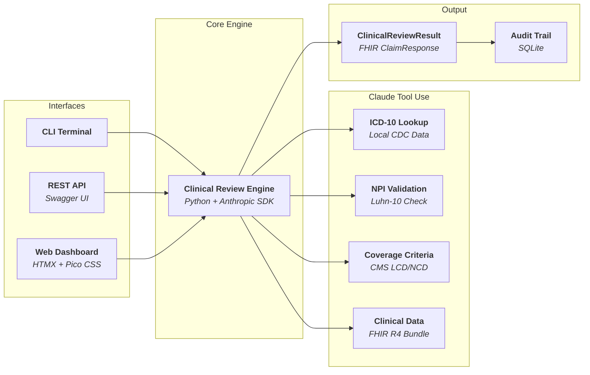
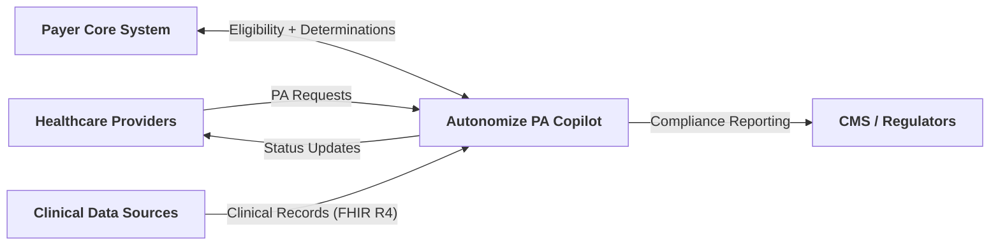
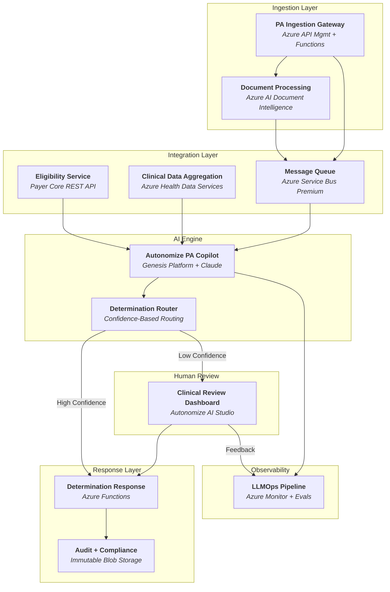

# AI-Driven Prior Authorization — Solution Architecture
## Autonomize AI | Paul Prae | www.paulprae.com

> 10 slides + appendix | Priority-tiered for conversational format | Under 30 minutes
>
> **Tier A** (Must Present): Slides 1-4 + Live Demo | **Tier B** (Architecture): Slides 5-9 | **Tier C** (Appendix): Slide 10 + Appendix slides

---

## Slide 1: Title & Introduction

# AI-Driven Prior Authorization
### Solution Architecture for a Large US Health Plan

**Paul Prae** | Principal AI Engineer & Architect
www.paulprae.com

---

## Slide 2: The Problem & Opportunity

**The Problem:** Manual PA processing costs **$10.97 in labor per provider transaction** ([CAQH 2024 Index](https://www.caqh.org/hubfs/Index/2024%20Index%20Report/CAQH_IndexReport_2024_FINAL.pdf)), takes days, and burns out clinical staff — **93% of physicians** say PA delays patient care ([AMA 2024 Survey](https://www.ama-assn.org/system/files/prior-authorization-survey.pdf)). On the payer side, each manual transaction costs **$3.52** versus roughly **$0.05** when fully electronic.

**The Opportunity — Altais + Autonomize AI** ([BusinessWire Feb 2026](https://www.businesswire.com/news/home/20260224376992/en/Altais-Cuts-Prior-Authorization-Review-Time-by-45-and-Reduces-Manual-Errors-by-54-with-Autonomize-AI)):
- **45%** reduction in PA review time
- **54%** reduction in manual errors
- **50%** auto-determination rate

**Why Autonomize AI:**
- Already live at **3 of the 5 largest US health plans** ([BusinessWire Feb 2026](https://www.businesswire.com/news/home/20260226730170/en/Autonomize-AI-Strengthens-Leadership-with-Senior-Healthcare-Marketing-and-Regulatory-Hires))
- PA Copilot available on **Azure Marketplace** ([listing](https://azuremarketplace.microsoft.com/en-us/marketplace/apps/284109.autonomize-prior-auth-copilot)), backed by **Microsoft Pegasus Program** membership ([BusinessWire Nov 2025](https://www.businesswire.com/news/home/20251105084154/en/Autonomize-AI-selected-to-join-the-Microsoft-for-Startups-Pegasus-Program-to-Expand-Enterprise-AI-Impact-in-Healthcare-and-Life-Sciences))
- **ServiceNow partnership** extends reach into payer workflows ([BusinessWire Mar 2026](https://www.businesswire.com/news/home/20260305091710/en/Autonomize-AI-Partners-with-ServiceNow-to-Build-AI-Driven-Healthcare-Solutions-for-Payers))
- **CMS-0057-F** regulatory deadline (Jan 2027) creates urgency — FHIR R4 APIs required for PA

---

## Slide 3: PA Request Lifecycle

**6-step process:** Submit → Intake (OCR/extraction) → Validate (eligibility) → AI Review (coverage matching + confidence scoring) → Route (auto-approve / human review / pend) → Respond (payer core writeback + provider notification)

---

## Slide 4: Demo — Proof of Concept

> "I built a working proof of concept to validate this architecture. It demonstrates the core clinical review flow — steps 4 and 5 of the lifecycle."

**What the demo implements:**

**Demo scope (Phase 0):**
- 5 realistic PA cases with real ICD-10/CPT codes
- AI reviews each case in ~30 seconds using Claude tool use
- FHIR R4 data models throughout (fhir.resources R4B)
- Three independent interfaces: CLI, REST API + Swagger, Web Dashboard

**Honest limitations:**
- Mock eligibility service (production: Payer Core System integration)
- Local coverage criteria (production: CMS Coverage Database API)
- Synthetic patient data (production: real clinical records via FHIR)
- Single-user demo (production: Azure Container Apps with auto-scaling)

> **[LIVE DEMO]** — See [demo-script.md](https://github.com/praeducer/autonomize-healthcare-ai-demo/blob/main/docs/presentation/demo-script.md) for the 5-minute CLI walkthrough

---

## Slide 5: System Context

> **"Four actors, one platform."** Providers submit PA requests. The Payer Core provides eligibility and receives determinations. Clinical data sources feed FHIR R4 records. CMS receives compliance reporting. Autonomize PA Copilot sits in the center — automating the clinical review, not replacing it.

---

## Slide 6a: Solution Architecture — Diagram

---

## Slide 6b: Solution Architecture — Components

| Component | Azure Service | Purpose |
|-----------|--------------|---------|
| Ingestion Gateway | API Management + Functions | Receives all PA channels |
| Document Processing | AI Document Intelligence | OCR for faxes |
| Eligibility Service | Payer Core REST API | Member validation |
| Clinical Data Aggregation | Health Data Services (FHIR R4) | Unified clinical context |
| PA Copilot | Genesis Platform + Claude | AI clinical review |
| Determination Router | Functions + Rules | Confidence-based routing |
| Clinical Review Dashboard | Autonomize AI Studio | Human reviewer interface |
| Determination Response | Azure Functions | Payer Core writeback + provider notification |
| LLMOps Pipeline | Azure Monitor + Evals | Performance monitoring + feedback loop |
| Audit & Compliance | Immutable Blob Storage | Tamper-proof audit trail |

---

## Slide 7: Why This Architecture

**Key business benefits of these specific technical choices:**

- **Safety-first determination routing** — confidence thresholds route low-certainty cases to human reviewers; no case is ever auto-denied without clinical review
- **Configurable confidence thresholds** — start conservative, tune with real performance data as the system learns
- **CMS-0057-F compliance readiness** — FHIR R4 foundation meets the Jan 2027 API deadline without re-architecture
- **Azure-native deployment** — leverages Autonomize's existing Azure ecosystem, Pegasus Program membership, and Marketplace presence
- **Full audit trail** — every determination records model version, input hash, reasoning, evidence, and confidence for 7-year regulatory retention

---

## Slide 8: Top 3 Security Risks & Mitigations

| # | Risk | Mitigation 1: Architectural | Mitigation 2: Operational |
| --- | ------ | ------------------------------ | --------------------------- |
| 1 | **PHI exposure through AI pipeline** | PHI tokenization before LLM — AI sees clinical facts without patient identity | Anthropic API usage ensures zero data retention for model training (per enterprise terms) |
| 2 | **Prompt injection via clinical documents** | Document sanitization + system prompt isolation | Output validation requiring evidence citations — hallucinated or injected claims fail verification |
| 3 | **Untraceable AI decisions** | Tamper-proof audit trail: model version, input hash, reasoning, evidence, confidence | Immutable 7-year retention with append-only writes |

**Additional controls:** Entra ID RBAC, AES-256 at rest, TLS 1.2+ in transit, private endpoints, no auto-deny without human review.

---

## Slide 9: Progressive Delivery — Agile, Iterative, Data-Driven

| Phase | Duration | What We Deliver | How We Work |
|-------|----------|----------------|-------------|
| **Phase 0: Demo** | Weeks 1-2 | Working AI PA review with mock data | Spike + validate core architecture |
| **Phase 1: MVP** | Weeks 3-6 | Single LOB, single channel in production | 2-week sprints, daily standups, human review on all cases |
| **Phase 2: Scale** | Weeks 7-10 | Multi-channel, multi-LOB | Iterate on real performance data, add fax OCR + legacy connectors |
| **Phase 3: Enterprise** | Weeks 11-12 | All channels, 20 LOBs, CMS reporting | Harden, load test, compliance validation |

**Each phase**: Design → Build → Test → Demo → Decision Gate. No phase starts without stakeholder sign-off on the previous one. Real performance data (accuracy, overturn rate, processing time) drives scope decisions — not assumptions.

---

## Slide 10: Discussion Starters

**For the team:**
- Which LOB would be the best Phase 1 candidate — and why?
- What auto-determination rate should we target for Phase 1?
- What's been the biggest integration surprise with existing payer deployments?

**What I'd want to learn in discovery:**
- How does Genesis handle coverage criteria updates today?
- What does the ServiceNow partnership mean for payer workflow integration?
- What Autonomize platform components are available for a new engagement?

---

## Appendix

### Appendix A: Clinical Data Integration

| Source | Protocol | Auth |
|--------|----------|------|
| Modern EMRs | FHIR R4 REST API | OAuth 2.0 / SMART on FHIR |
| Legacy DB Connector | DB connector / HL7 v2 | Service account + VNet |

**FHIR R4 role:** Interoperability standard for clinical data exchange. Modern sources expose it natively. Legacy data normalized to FHIR-compatible format before AI processing. Deep FHIR implementation is a discovery-phase activity with the implementation team.

**Security boundary:** All clinical data passes through PHI tokenization layer before reaching the AI engine.

### Appendix B: AI Model Monitoring & Feedback

**Detect drift:**
- Outcome monitoring — track overturn rate (human overrides AI), appeal rate, accuracy trends
- Automated evals — golden test cases benchmarked on schedule
- Confidence distribution — shifts signal model or data changes

**Feedback loop:**
1. Human reviewer corrections → updated eval dataset
2. Eval dataset → benchmark new model versions vs current
3. If improved → staged blue-green rollout
4. Guardrails always active: input filtering, output validation, clinical safety

### Appendix C: Scaling to 20 LOBs

| Approach | Cost | Isolation | Complexity |
|----------|------|-----------|------------|
| **Multi-tenant** | Lower | Logical | Lower |
| **Multi-instance** | Higher | Physical | Higher |

**Recommendation:** Multi-tenant with per-LOB configuration. Separate instances only where regulation requires physical isolation. The right answer depends on actual LOB rule complexity — a discovery question.

---

## Sources

| # | Claim | Source | Notes |
| --- | ----- | ------ | ----- |
| 1 | $10.97 manual PA labor cost (provider) | [2024 CAQH Index, p. 9](https://www.caqh.org/hubfs/Index/2024%20Index%20Report/CAQH_IndexReport_2024_FINAL.pdf) | Prior Authorization row; weighted avg labor cost (salaries + benefits + overhead) per manual transaction; excludes system costs |
| 2 | $3.52 manual PA labor cost (payer) | [2024 CAQH Index, p. 9](https://www.caqh.org/hubfs/Index/2024%20Index%20Report/CAQH_IndexReport_2024_FINAL.pdf) | Prior Authorization row; weighted avg labor cost per manual transaction, health plan side |
| 3 | ~$0.05 electronic PA cost (payer) | [2024 CAQH Index, p. 9](https://www.caqh.org/hubfs/Index/2024%20Index%20Report/CAQH_IndexReport_2024_FINAL.pdf) | Fully electronic transaction cost |
| 4 | 45% PA review time reduction | [Altais + Autonomize AI press release (Feb 2026)](https://www.businesswire.com/news/home/20260224376992/en/Altais-Cuts-Prior-Authorization-Review-Time-by-45-and-Reduces-Manual-Errors-by-54-with-Autonomize-AI) | Headline metric from joint press release |
| 5 | 54% manual error reduction | [Altais + Autonomize AI press release (Feb 2026)](https://www.businesswire.com/news/home/20260224376992/en/Altais-Cuts-Prior-Authorization-Review-Time-by-45-and-Reduces-Manual-Errors-by-54-with-Autonomize-AI) | Headline metric from joint press release |
| 6 | 50% auto-determination rate | [Altais + Autonomize AI press release (Feb 2026)](https://www.businesswire.com/news/home/20260224376992/en/Altais-Cuts-Prior-Authorization-Review-Time-by-45-and-Reduces-Manual-Errors-by-54-with-Autonomize-AI) | Headline metric from joint press release |
| 7 | 93% of physicians say PA delays care | [AMA 2024 Prior Authorization Survey, p. 5](https://www.ama-assn.org/system/files/prior-authorization-survey.pdf) | Survey of 1,000 practicing physicians, Dec 2024 |
| 8 | CMS-0057-F Phase 1 operational Jan 2026 | [CMS Interoperability & Prior Authorization Final Rule Fact Sheet](https://www.cms.gov/newsroom/fact-sheets/cms-interoperability-prior-authorization-final-rule-cms-0057-f) | Operational provisions: decision timeframes, metrics reporting |
| 9 | CMS-0057-F Phase 2 APIs due Jan 2027 | [CMS Interoperability & Prior Authorization Final Rule Fact Sheet](https://www.cms.gov/newsroom/fact-sheets/cms-interoperability-prior-authorization-final-rule-cms-0057-f) | API requirements: Patient Access, Provider Access, Payer-to-Payer, Prior Authorization APIs |
| 10 | Autonomize live at 3 of 5 largest US health plans | [Autonomize AI leadership hires press release (Feb 2026)](https://www.businesswire.com/news/home/20260226730170/en/Autonomize-AI-Strengthens-Leadership-with-Senior-Healthcare-Marketing-and-Regulatory-Hires) | Exact wording: "live at three of the five largest U.S. health plans" |
| 11 | Autonomize Prior Auth Copilot on Azure Marketplace | [Azure Marketplace listing](https://azuremarketplace.microsoft.com/en-us/marketplace/apps/284109.autonomize-prior-auth-copilot) | SaaS product listing |
| 12 | Autonomize + ServiceNow partnership | [Autonomize + ServiceNow press release (Mar 2026)](https://www.businesswire.com/news/home/20260305091710/en/Autonomize-AI-Partners-with-ServiceNow-to-Build-AI-Driven-Healthcare-Solutions-for-Payers) | AI-driven healthcare solutions for payers |
| 13 | Claude models available in Azure AI Foundry | [Microsoft Learn: Deploy Claude in Microsoft Foundry](https://learn.microsoft.com/en-us/azure/foundry/foundry-models/how-to/use-foundry-models-claude) | Opus, Sonnet, Haiku model families via global standard deployment |
| 14 | Autonomize Genesis Platform | [Autonomize AI Prior Authorization Copilot press release (Apr 2025)](https://www.globenewswire.com/news-release/2025/04/24/3067359/0/en/Autonomize-AI-Prior-Authorization-Copilot-Helping-Patients-Get-Care-Faster-Safer-and-with-Less-Stress.html) | PA Copilot "built on the Genesis Platform"; Compound AI architecture |
| 15 | Autonomize in Microsoft Pegasus Program | [Autonomize AI joins Pegasus Program (Nov 2025)](https://www.businesswire.com/news/home/20251105084154/en/Autonomize-AI-selected-to-join-the-Microsoft-for-Startups-Pegasus-Program-to-Expand-Enterprise-AI-Impact-in-Healthcare-and-Life-Sciences) | Invite-only Microsoft for Startups program; up to 24-month enterprise acceleration |
